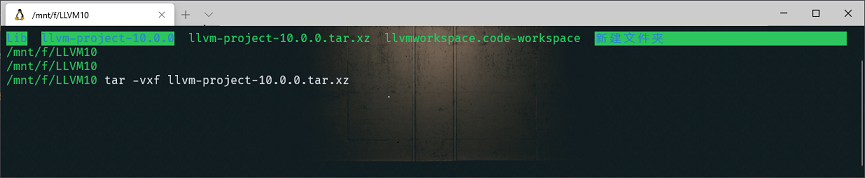
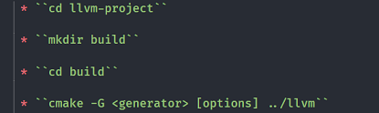
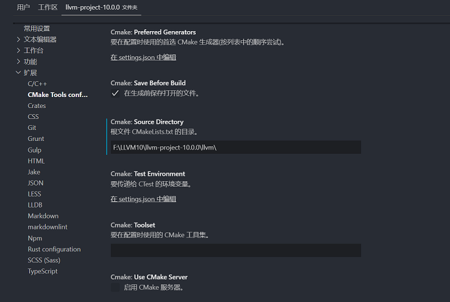
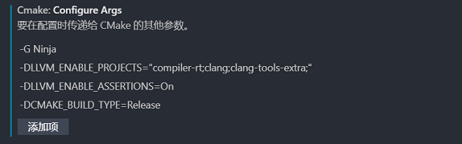
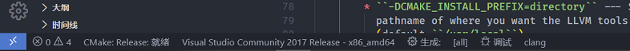

# Windows 下通过 CMAKE 搭建 LLVM 环境

本文主要介绍如何在 Windows 下通过 vscode 使用 Cmake+Ninja 来编译 LLVM 源码，从而搭建 LLVM 环境以及生成 clang 的 Tools 相关库。

## 前因

1. 为啥要编译源码，预编译包它不香么？
    - 确实 LLVM 官方已经提供了 Win32 版本的预编译包，但是我尝试安装了9.0.1版本与10.0.0版本，它居然都没有 clang 的 libTooling 相关的库，这就很难受了所以为了能使用 clang Tools 只好从头做起，如果哪位同学知道为啥不提供 libtooling 这些库的原因请告诉下，谢谢~😂。

2. 为啥非得在 Windows 下，Linux 不是更方便？
    - 我在 Linux 下也搭建了一下 9.0.1 版本，直接在 LLVM 官网上下载对应版本与系统的预编译包，解压及用、库又全又好用😀。
    - 但是由于我使用的 Ubuntu WSL 子系统，通过 Vscode 的 WSL 插件连接上后发现对 c++ 插件支持貌似有问题，代码颜色渲染信息不全，不清楚是 GCC 编译器问题还是啥原因，导致强迫症患者不想在 WSL 系统直接开发，知道原因的大佬求告知，反正当前的项目是通过 CMake 管理，所以决定在 windows 下开发完成后在移植到 Linux 下。

3. 废话就说这么多现在开始。

------------------------------

我是分割线

------------------------------

## 系统环境

1. Win10 操作系统，已经安装了 VS2017 全家桶。包括最最重要的 msvc2017_64 工具包、Vscode、以及 camke(version 3.12.18081601-MSVC_2) 工具。当然如果你不想装那么巨大的 IDE，也可以单独安装 mingw + cmake 网上的教程也很多。

2. 环境变量正确配置，例如在 powershell 或 cmd 中敲 cmake.exe -version 可以打印出安装的工具版本，确保你的编译器相关工具也可以正常工作。

## Let's Begin

### 获取 LLVM Project 源码

查找了一些网上的资料发现下载源码超级麻烦，要么是需要安装 svn 、要么去官网下载，并且需要下载这个源码然后在下那个源码，一眼看过去就迷失在了未知的海洋里嘞。因此在这里推荐直接下载 llvm-project 源码合集大礼包，可以避免很多问题。

1. 如果你是在担忧源码编译出来过大以及多余你不需要的模块，那么不用担心，llvm 的贴心的准备了裁剪编译命令，帮助你只构建需要的模块。
    - 考虑到当时我下载时艰辛的网速，[你也可以通过这里下载 10.0.0 版本的源码](https://pan.baidu.com/s/1xxCf43Gg-S3idpyCZ1WbQA )，提取码：u0sf。

2. 此时你已经拿到了源码包，开开心心的右键 -> 解压到当前文件夹 -> 等待 -> ..... -> 错误：无法创建文件。 What???
    - 我遇到的问题主要是由于压缩包中包含软连接，当前 Windows 下文件系统不支持创建，导致错误。最终我是直接通过 WSL 子系统，使用命令 tar 解压的。所以如果在 Windows 下解压失败的话可以尝试在 Linux 中解压然后在拷贝出来。

    

### 使用 Vscode 打开&编译 LLVM Project

在打开之前，需要介绍一个很重要的工具，它就是 CmakeTools，作为 Vscode 的插件，在管理使用 cmake 构建的工程非常好用，可以方便的配置使用的编译器、编译模式、使用GDB、**控制生成模块**。因此如果你不想耗费精力去管理工程或者输入编译命令，那么我强烈建议你安装一个。

1. 安装好 CmakeTools 工具后，通过 vscode 打开 llvm-project 的源码文件夹。如果你的环境变量正确，编译器、cmake 工具能正确搜索到，那么 CmakeTools 会自动使用 cmake 工具配置当前项目，但是由于 llvm-project 的源码根目录中并没有 CMakeLists.txt，因此 CmakeTools 工具会提示一个错误。
    - 解决的办法就在根目录中的 README.md 中，可以看到几个步骤，其中 mkdir build 的步骤其实 CmakeTools 默认就会在当前文件夹根目录创建 build 用于保存编译中间文件因此略过。主要看到其中 cmake 命令对应的 ../llvm 目录，可知作为入口的 CMakeLists.txt 就在 llvm 目录中。

    

    - 因此配置 cmaketools 的根目录为 llvm 目录。

    

2. 这时你的 CmakeTools 应该就可以正确的工作了。以下就是我当前环境中的 CmakeTools 在配置 CMakeLists.txt 时的输出信息，可以看到最终是配置成功的。

    ```sh
    [variant] 已加载一组新变量
    [kit] 已成功从 C:\Users\Administrator\AppData\Local\CMakeTools\cmake-tools-kits.json 加载 14 工具包
    [main] 正在配置文件夹: llvm-project-10.0.0
    [cmake] clang project is enabled
    [cmake] clang-tools-extra project is enabled
    [cmake] compiler-rt project is disabled
    [cmake] debuginfo-tests project is disabled
    [cmake] libc project is disabled
    [cmake] libclc project is disabled
    [cmake] libcxx project is disabled
    [cmake] libcxxabi project is disabled
    [cmake] libunwind project is disabled
    [cmake] lld project is disabled
    [cmake] lldb project is disabled
    [cmake] llgo project is disabled
    [cmake] mlir project is disabled
    [cmake] openmp project is disabled
    [cmake] parallel-libs project is disabled
    [cmake] polly project is disabled
    [cmake] pstl project is disabled
    [cmake] Could NOT find Z3: Found unsuitable version "0.0.0", but required is at least "4.7.1" (found Z3_LIBRARIES-NOTFOUND)
    [cmake] Could NOT find Backtrace (missing: Backtrace_LIBRARY Backtrace_INCLUDE_DIR)
    [cmake] Native target architecture is X86
    [cmake] Threads enabled.
    [cmake] Doxygen disabled.
    [cmake] Go bindings disabled.
    [cmake] Ninja version: 1.8.2
    [cmake] Could NOT find OCaml (missing: OCAMLFIND OCAML_VERSION OCAML_STDLIB_PATH)
    [cmake] OCaml bindings disabled.
    [cmake] LLVM host triple: x86_64-pc-windows-msvc
    [cmake] LLVM default target triple: x86_64-pc-windows-msvc
    [cmake] Using Release VC++ CRT: MD
    [cmake] Constructing LLVMBuild project information
    [cmake] LLVMHello ignored -- Loadable modules not supported on this platform.
    [cmake] Targeting AArch64
    [cmake] Targeting AMDGPU
    [cmake] Targeting ARM
    [cmake] Targeting BPF
    [cmake] Targeting Hexagon
    [cmake] Targeting Lanai
    [cmake] Targeting Mips
    [cmake] Targeting MSP430
    [cmake] Targeting NVPTX
    [cmake] Targeting PowerPC
    [cmake] Targeting RISCV
    [cmake] Targeting Sparc
    [cmake] Targeting SystemZ
    [cmake] Targeting WebAssembly
    [cmake] Targeting X86
    [cmake] Targeting XCore
    [cmake] Clang version: 10.0.0
    [cmake] PrintFunctionNames ignored -- Loadable modules not supported on this platform.
    [cmake] AnnotateFunctions ignored -- Loadable modules not supported on this platform.
    [cmake] BugpointPasses ignored -- Loadable modules not supported on this platform.
    [cmake] Bye ignored -- Loadable modules not supported on this platform.
    [cmake] TestPlugin ignored -- Loadable modules not supported on this platform.
    [cmake] -- Version: 0.0.0
    [cmake] -- Performing Test HAVE_GNU_POSIX_REGEX -- failed to compile
    [cmake] -- Performing Test HAVE_POSIX_REGEX -- failed to compile
    [cmake] CMake Warning at utils/benchmark/CMakeLists.txt:244 (message):
    [cmake]   Using std::regex with exceptions disabled is not fully supported
    [cmake]
    [cmake]
    [cmake] -- Performing Test HAVE_STEADY_CLOCK -- success
    [cmake] Configuring done
    [cmake] Generating done
    ```

3. 这里如果想要编译其他模块例如 `[cmake] clang project is enabled`，还需要在 CmakeTools 配置的时候传入一些参数，如图。参数的含义可以看根目录中 README.md 中有详细的解释。这里有个问题就是像我配置的第一项 `compiler-rt` 其实依旧是 `disabled` 的，怀疑是 LLVM 的 CMakeLists.txt 解析有 BUG 或者我哪里配置的还是不对，请了解的大佬告知。
    - 这里有一点需要注意，CMakeTools 默认也是编译 Debug 模式，但是这对电脑内存要求较高，耗时同样很长，因此我这里配置参数编译的是 Release 版本。

    

4. 最终当这一切配置完成，点击 CmakeTools 中的 `生成` 按钮，就可以开始编译了。

    

### Build

最终编译完成后，会在根目录的 build 文件夹中生成许多文件，其中 `lib` 就包括所有生成的库文件。
注意 LLVM 中有一些头文件时在编译过程中针对平台生成，也在 build 目录中，当使用库时发现头文件找不到的情况，可以去 build 中搜索下查找。

至此，LLVM 就成功编译完成，接下来就可以开心的搞事情了。
