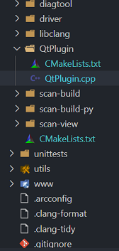
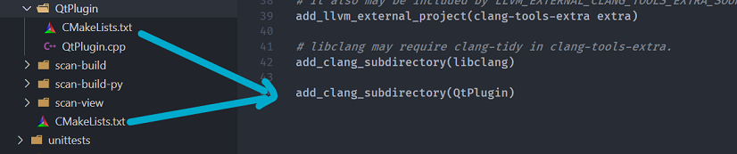
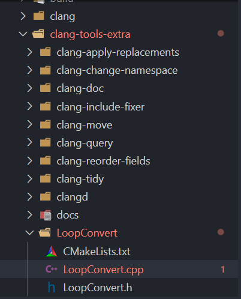
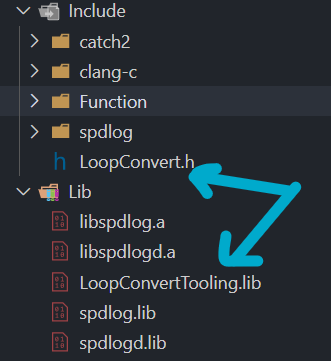
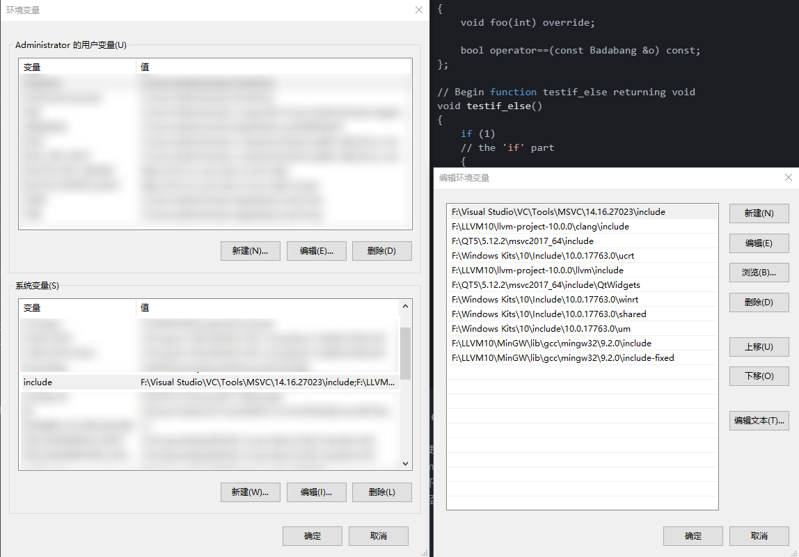
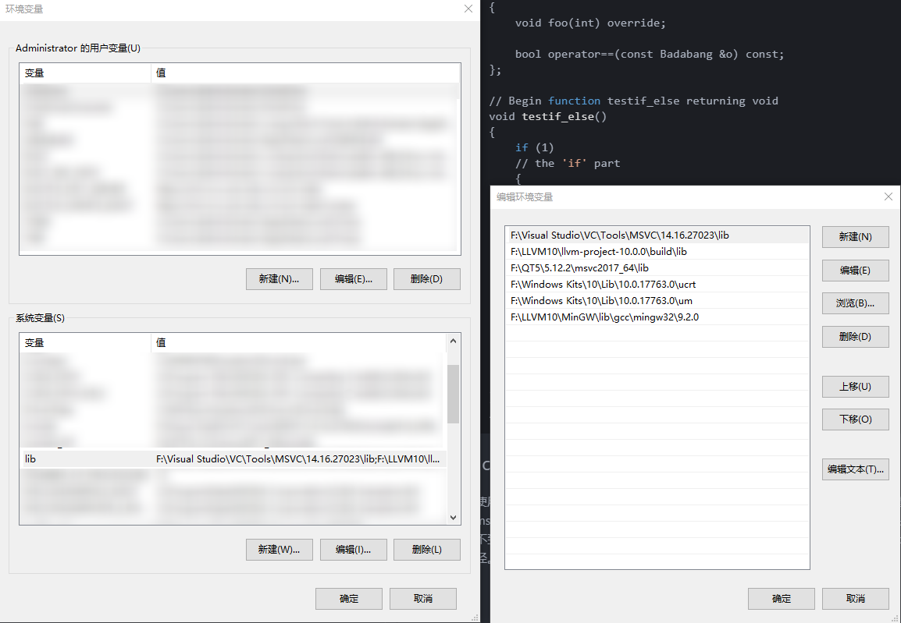

# Windows 下构建自己的 Clang libTooling 工具

## 什么是 Clang libTooling 工具

- Clang 我想会看这篇文章的人应该都不会完全陌生，现在 Clang 不仅仅是一个编译器的前端，我们可以通过一些方法使用 Clang 强大的源码解析、检查等功能。如果想要详细了解点[这里的官方文档](http://clang.llvm.org/docs/)和[大佬的BLOG](https://www.jianshu.com/p/403dd226c420)：
  1. libclang : 它还可以作为一个功能库提供一些用于源码解析 AST 的稳定高级 C 语言抽象接口。
  2. clang libTooling : C++ 接口，旨在编写独立工具，以及集成到运行 clang 工具的服务中。
  3. clang plugin : Clang 插件允许您在 AST 上添加运行其他操作作为编译的一部分。插件是由编译器在运行时加载的动态库，它们很容易集成到构建环境中。

## It's time up

- 本文主要介绍如何通过 llvm 工程构建属于自己的 Clang Tooling 工具。主要分为两个部分：
  1. 通过 llvm 工程构建一个可以提供自己需要的功能工具。
  2. 如何将该工具以模块的形式集成到自己的工程中。
  3. 直接通过源码在自己的工程中进行编译。

### 构建一个代码解析工具

其实[参考](https://juejin.im/post/5c3075bae51d455270151f41)这篇文档描述的很详细了，如果你已经正确通过源码搭建了 LLVM 环境，那么操作起来是非常简单的。

1. 首先，在 clang/tools/ 目录下新加一个自己需要的工具目录，这里以 `QtPlugin` 为例，然后添加自己的源文件以及 CmakeLists.txt。
    - 

2. 修改父目录下的 CMakeLists.txt 添加刚刚创建的 QtPlugin 目录。
    - 

3. 接下来编写自己想要的功能代码，然后创建编写 QtPlugin 目录下的 CmakeLists.txt 参考着同一级目录中其他 tools 来就行。

    ```sh
    set(LLVM_LINK_COMPONENTS
    Support
    )

    add_clang_executable(QTPluginTooling
        QtPlugin.cpp
    )

    clang_target_link_libraries(QTPluginTooling
        PRIVATE
        clangAST
        clangBasic
        clangDriver
        clangFormat
        clangLex
        clangParse
        clangSema
        clangFrontend
        clangTooling
        clangToolingCore
        clangRewrite
        clangRewriteFrontend
    )
    ```

4. 接下来确保你的 CMakeTools 参数配置项 clang 模块处于 enable 状态(详情参见配置 LLVM环境配置)，通过点击生成，CMakeTools 工具直接编译生成即可。最终可以在 build/bin 目录下找到你刚刚生成的工具。

### 将工具集成到你的工程中

Emmmm... 可能你觉得生成个可执行得工具并不满足，想要让 clang 强大得功能在自己项目中更加`紧密`的使用，那么你可以直接集成 clang 已经提供的 libTooling 等功能库，甚至自己生成定制的功能模块，以库得形式提供功能到你的项目中。

- [这里有一个很棒的 github 项目关于 LLVM-clang 的使用示例](https://github.com/eliben/llvm-clang-samples)，可惜的是由于 LLVM-clang 发展的迅速，C++ 接口并不稳定，10.0.0版本的程序可能在下一版本编译都会失败掉，因此本小节会选取一个简单的示例，可以在 10.0.0 下编译通过，生成功能库后集成到自己的项目中。

1. 还记得上一节中的 clang 文件夹么，我们在其中编写了程序以及 CmakeLists.txt 最终生成了可以执行的小工具。而这一节我们的目的是生成一个库，这里我是将工具源码目录放到了与 clang 同级的目录下，可以找到一个 clang-tool-extra 文件夹内，可以发现这个目录下就是一些 clang 提供得扩展功能库，因此我们首先需要在这个目录下创建一个自己得工具文件夹，并如图中一样创建需要的源文件以及 CmakeLists.txt 。

    

2. 为 LoopConvert.cpp 和 LoopConvert.h 添加源代码，[参考的源代码](https://github.com/eliben/llvm-clang-samples/blob/master/src_clang/tooling_sample.cpp)，这里由于我们的目标是生成一个库，因此将 main 函数变成一个 C 接口功能函数，以及将功能类得定义抽出到 .h 头文件中，方便我们自己的项目调用相应得功能。llvm-clang-samples 项目中的源代码有一些接口兼容性的错误已经修复，下边是源码：

    ```c++
    //------------------------------------------------------------------------------
    //  LoopConvert.h
    //------------------------------------------------------------------------------
    #include <clang/Frontend/FrontendActions.h>
    #include <clang/Rewrite/Core/Rewriter.h>

    namespace clang {
    // For each source file provided to the tool, a new FrontendAction is created.
    class MyFrontendAction : public ASTFrontendAction {
    public:
    MyFrontendAction() {}
    void EndSourceFileAction() override;

    std::unique_ptr<ASTConsumer> CreateASTConsumer(CompilerInstance &CI,
                                                    StringRef file) override;

    private:
    Rewriter TheRewriter;
    };
    } // namespace clang

    int Function(int argc, const char **argv);
    ```

    ```c++
    //------------------------------------------------------------------------------
    //  LoopConvert.cpp
    //------------------------------------------------------------------------------
    // Tooling sample. Demonstrates:
    //
    // * How to write a simple source tool using libTooling.
    // * How to use RecursiveASTVisitor to find interesting AST nodes.
    // * How to use the Rewriter API to rewrite the source code.
    //
    // Eli Bendersky (eliben@gmail.com)
    // This code is in the public domain
    //------------------------------------------------------------------------------
    #include <sstream>
    #include <string>

    #include "clang/AST/AST.h"
    #include "clang/AST/ASTConsumer.h"
    #include "clang/AST/RecursiveASTVisitor.h"
    #include "clang/Frontend/ASTConsumers.h"
    #include "clang/Frontend/CompilerInstance.h"
    #include "clang/Tooling/CommonOptionsParser.h"
    #include "clang/Tooling/Tooling.h"
    #include "llvm/Support/raw_ostream.h"
    #include <llvm\ADT\STLExtras.h>

    #include "LoopConvert.h"

    using namespace clang;
    using namespace clang::driver;
    using namespace clang::tooling;

    static llvm::cl::OptionCategory ToolingSampleCategory("Tooling Sample");

    // By implementing RecursiveASTVisitor, we can specify which AST nodes
    // we're interested in by overriding relevant methods.
    class MyASTVisitor : public RecursiveASTVisitor<MyASTVisitor> {
    public:
    MyASTVisitor(Rewriter &R) : TheRewriter(R) {}

    bool VisitStmt(Stmt *s) {
        // Only care about If statements.
        if (isa<IfStmt>(s)) {
        IfStmt *IfStatement = cast<IfStmt>(s);
        Stmt *Then = IfStatement->getThen();

        TheRewriter.InsertText(Then->getBeginLoc(), "// the 'if' part\n", true,
                                true);

        Stmt *Else = IfStatement->getElse();
        if (Else)
            TheRewriter.InsertText(Else->getBeginLoc(), "// the 'else' part\n",
                                true, true);
        }

        return true;
    }

    bool VisitFunctionDecl(FunctionDecl *f) {
        // Only function definitions (with bodies), not declarations.
        if (f->hasBody()) {
        Stmt *FuncBody = f->getBody();

        // Type name as string
        QualType QT = f->getReturnType();
        std::string TypeStr = QT.getAsString();

        // Function name
        DeclarationName DeclName = f->getNameInfo().getName();
        std::string FuncName = DeclName.getAsString();

        // Add comment before
        std::stringstream SSBefore;
        SSBefore << "// Begin function " << FuncName << " returning " << TypeStr
                << "\n";
        SourceLocation ST = f->getSourceRange().getBegin();
        TheRewriter.InsertText(ST, SSBefore.str(), true, true);

        // And after
        std::stringstream SSAfter;
        SSAfter << "\n// End function " << FuncName;
        ST = FuncBody->getEndLoc().getLocWithOffset(1);
        TheRewriter.InsertText(ST, SSAfter.str(), true, true);
        }

        return true;
    }

    private:
    Rewriter &TheRewriter;
    };

    // Implementation of the ASTConsumer interface for reading an AST produced
    // by the Clang parser.
    class MyASTConsumer : public ASTConsumer {
    public:
    MyASTConsumer(Rewriter &R) : Visitor(R) {}

    // Override the method that gets called for each parsed top-level
    // declaration.
    bool HandleTopLevelDecl(DeclGroupRef DR) override {
        for (DeclGroupRef::iterator b = DR.begin(), e = DR.end(); b != e; ++b) {
        // Traverse the declaration using our AST visitor.
        Visitor.TraverseDecl(*b);
        (*b)->dump();
        }
        return true;
    }

    private:
    MyASTVisitor Visitor;
    };

    std::unique_ptr<ASTConsumer>
    MyFrontendAction::CreateASTConsumer(CompilerInstance &CI, StringRef file) {
        llvm::errs() << "** Creating AST consumer for: " << file << "\n";
        TheRewriter.setSourceMgr(CI.getSourceManager(), CI.getLangOpts());
        return std::make_unique<MyASTConsumer>(TheRewriter);
    }
    void MyFrontendAction::EndSourceFileAction() {
        SourceManager &SM = TheRewriter.getSourceMgr();
        llvm::errs() << "** EndSourceFileAction for: "
                    << SM.getFileEntryForID(SM.getMainFileID())->getName() << "\n";

        // Now emit the rewritten buffer.
        TheRewriter.getEditBuffer(SM.getMainFileID()).write(llvm::outs());
    }

    int Function(int argc, const char **argv) {
        CommonOptionsParser op(argc, argv, ToolingSampleCategory);
        ClangTool Tool(op.getCompilations(), op.getSourcePathList());

        // ClangTool::run accepts a FrontendActionFactory, which is then used to
        // create new objects implementing the FrontendAction interface. Here we use
        // the helper newFrontendActionFactory to create a default factory that will
        // return a new MyFrontendAction object every time.
        // To further customize this, we could create our own factory class.
        return Tool.run(newFrontendActionFactory<MyFrontendAction>().get());
    }
    ```

3. 编写 CmakeLists.txt ，这部分参考其他目录下的工具编写即可：

    ```sh
    set(LLVM_LINK_COMPONENTS
    Support
    )

    add_clang_library(LoopConvertTooling
        LoopConvert.cpp

        LINK_LIBS
        clangAST
        clangBasic
        clangDriver
        clangFormat
        clangLex
        clangParse
        clangSema
        clangFrontend
        clangTooling
        clangToolingCore
        clangRewrite
        clangRewriteFrontend
    )
    ```

4. 在 clang-tools-extra 目录下的  CmakeLists.txt 下添加我们新增工具的目录。`add_subdirectory(LoopConvert)`。

5. 一切准备就绪，确保 clang-tools-extra 编译指令是 enable ，点击 CmakeTools 的生成按钮即可，最终即可在 build/lib 目录下生成我们定制的的功能库，即 LoopConvertTooling.lib：

    ```sh
    [main] 正在生成文件夹: llvm-project-10.0.0
    [build] 正在启动生成
    [proc] 执行命令: "F:\Visual Studio\Common7\IDE\CommonExtensions\Microsoft\CMake\CMake\bin\cmake.EXE" --build f:/LLVM10/llvm-project-10.0.0/build --config Release --target all -- -j 14
    [build] [1/2  50% :: 16.844] Building CXX object tools\clang\tools\extra\LoopConvert\CMakeFiles\obj.LoopConvertTooling.dir\LoopConvert.cpp.obj
    [build] [2/2 100% :: 17.265] Linking CXX static library lib\LoopConvertTooling.lib
    [build] 生成已完成，退出代码为 0

    ```

-----------------------------------------------------

-----------------------------------------------------

1. 接下来就是如何将我们生成的 LoopConvertTooling 库集成到我们自己的项目中去玩耍了，首先举个栗子，下边是我的测试代码，简单的调用了测试用的 C 接口：

    ```c++
    //------------------------------------------------------------------------------
    //  main.cpp
    //------------------------------------------------------------------------------
    #include "LoopConvert.h"
    #include "spdlog/spdlog.h"

    int main(int argc, const char *argv[])
    {
        if ((argc > 3) || (argc < 2))
        {
            spdlog::info("You input wrong number arguments!\n");
            return -1;
        }

        FILE *result = fopen(argv[1], "r");
        if (result == NULL)
        {
            spdlog::info("Can't open the file: {}.\n", argv[1]);
            return -1;
        }

        return Function(argc, argv);
    }
    ```

2. 首先要确保有环境变量或者指定路径可以找到我们刚才生成的 LoopConvertTooling 库和 LoopConvert.h 头文件。如图我将其拷到了我的工程目录下。

    

3. 接下来是编写用于编译&链接相关功能库的 CMakeLists.txt 文件。find_package 用于会在 CMAKE_PREFIX_PATH 环境变量路径中查找相应的库文件。link_directories 与 include_directories 会自动在指定的路径中查找头文件和库。

    

    ```sh
    find_package(LLVM REQUIRED CONFIG)
    find_package(Clang REQUIRED CONFIG)

    #指定连结库的路径
    link_directories(${CLANG_LIB_PATH} ./Lib)
    #指定头文件查找路径
    include_directories(Include ${CLANG_INCLUDE_PATH})
    ```

4. 最终在 target_link_libraries 中链接如下的库。 `${LLVMSupport}` 与 `${clangxxx}` 这些都要在成功 find_package 后才能正确使用：

    ```sh
    target_link_libraries(${PROJECT_NAME} PRIVATE

    ${linkLib}
    LoopConvertTooling

    ${clangAST}
    ${clangBasic}
    ${clangDriver}
    ${clangFormat}
    ${clangLex}
    ${clangParse}
    ${clangSema}
    ${clangFrontend}
    ${clangTooling}
    ${clangToolingCore}
    ${clangRewrite}
    ${clangRewriteFrontend}

    ${LLVMSupport}
    )
    ```

5. 最终编译我们的项目，注意这里使用的时 clang-cl 为前端，如果直接使用 cl.exe 编译的话会有大量 warning 警告，原因是 clang 与 msvc-cl 有一些基础变量定义不同造成：

    ```sh
    [cms-client] 正在使用“Ninja”CMake 生成器进行配置
    [cms-client] 正在使用“Ninja”CMake 生成器进行配置
    [cmake] The CXX compiler identification is Clang 10.0.0
    [cmake] Check for working CXX compiler: F:/LLVM10/Lib/bin/clang-cl.exe
    [cmake] Check for working CXX compiler: F:/LLVM10/Lib/bin/clang-cl.exe -- works
    [cmake] Detecting CXX compiler ABI info
    [cmake] Detecting CXX compiler ABI info - done
    [cmake] Detecting CXX compile features
    [cmake] Detecting CXX compile features - done
    [cmake] Looking for C++ include pthread.h
    [cmake] Looking for C++ include pthread.h - not found
    [cmake] Found Threads: TRUE  
    [cmake] Configuring done
    [cmake] Generating done
    [build] 正在启动生成
    [proc] 执行命令: "F:\Visual Studio\Common7\IDE\CommonExtensions\Microsoft\CMake\CMake\bin\cmake.EXE" --build f:/WorkSpace/AutoTestProject/AUTestTools/build --config Release --target all -- -j 14
    [build] [2/15   6% :: 0.103] Automatic MOC and UIC for target ProjectUnitTest
    [build] [2/13  15% :: 0.275] Automatic MOC and UIC for target Automated_UnitTest
    [build] [12/13  23% :: 0.377] Building CXX object CMakeFiles\Automated_UnitTest.dir\Src\test.cpp.obj
    [build] [12/13  30% :: 0.401] Building CXX object CMakeFiles\Automated_UnitTest.dir\qrc_image.cpp.obj
    [build] [12/13  38% :: 2.254] Building CXX object CMakeFiles\Automated_UnitTest.dir\Src\window\DiagramWindow\Arrow.cpp.obj
    [build] [12/13  46% :: 2.352] Building CXX object CMakeFiles\Automated_UnitTest.dir\Automated_UnitTest_autogen\mocs_compilation.cpp.obj
    [build] [12/13  53% :: 4.049] Building CXX object CMakeFiles\Automated_UnitTest.dir\Src\window\DiagramWindow\DiagramTextItem.cpp.obj
    [build] [12/13  61% :: 4.158] Building CXX object CMakeFiles\Automated_UnitTest.dir\Src\main.cpp.obj
    [build] [12/13  69% :: 4.235] Building CXX object CMakeFiles\Automated_UnitTest.dir\Src\window\DiagramWindow\DiagramScene.cpp.obj
    [build] [12/13  76% :: 4.295] Building CXX object CMakeFiles\Automated_UnitTest.dir\Src\window\DiagramWindow\DiagramItem.cpp.obj
    [build] [12/13  84% :: 5.678] Building CXX object CMakeFiles\Automated_UnitTest.dir\Src\window\mainwindow.cpp.obj
    [build] [12/13  92% :: 6.419] Building CXX object CMakeFiles\Automated_UnitTest.dir\Src\window\DiagramWindow\DiagramSceneWindow.cpp.obj
    [build] [13/13 100% :: 6.760] Linking CXX executable Automated_UnitTest.exe
    [build] 生成已完成，退出代码为 0
    ```

6. 执行一下生成的 .exe 程序：

    ```c++
    //测试用的输入文件 test.cpp
    enum class Cpp11Enum
    {
        RED = 10,
        BLUE = 20
    };

    struct Wowza
    {
        virtual ~Wowza() = default;
        virtual void foo(int i = 0) = 0;
    };

    struct Badabang : Wowza
    {
        void foo(int) override;

        bool operator==(const Badabang &o) const;
    };

    void testif_else()
    {
        if (1)
        {
            int a = 10;
        }
        else if (2)
        {
            int b = 20;
        }
        else
        {
            int c = 20;
        }
    }
    template <typename T>
    void bar(T &&t);
    ```

    ```sh
    F:\WorkSpace\AutoTestProject\AUTestTools>"F:\WorkSpace\AutoTestProject\AUTestTools\build\test\ProjectUnitTest.exe" ./Src/test.cpp
    Error while trying to load a compilation database:
    Could not auto-detect compilation database for file "./Src/test.cpp"
    No compilation database found in F:\WorkSpace\AutoTestProject\AUTestTools\Src or any parent directory
    fixed-compilation-database: Error while opening fixed database: no such file or directory
    json-compilation-database: Error while opening JSON database: no such file or directory
    Running without flags.
    ** Creating AST consumer for: F:\WorkSpace\AutoTestProject\AUTestTools\Src\test.cpp
    EnumDecl 0x1a5b6119e60 <F:\WorkSpace\AutoTestProject\AUTestTools\Src\test.cpp:1:1, line:5:1> line:1:12 class Cpp11Enum 'int'
    |-EnumConstantDecl 0x1a5b6119f68 <line:3:5, col:11> col:5 RED 'Cpp11Enum'
    | `-ConstantExpr 0x1a5b6119f48 <col:11> 'int' Int: 10
    |   `-IntegerLiteral 0x1a5b6119f20 <col:11> 'int' 10
    `-EnumConstantDecl 0x1a5b611a008 <line:4:5, col:12> col:5 BLUE 'Cpp11Enum'
    `-ConstantExpr 0x1a5b6119fe8 <col:12> 'int' Int: 20
        `-IntegerLiteral 0x1a5b6119fc0 <col:12> 'int' 20
    CXXRecordDecl 0x1a5b611a060 <F:\WorkSpace\AutoTestProject\AUTestTools\Src\test.cpp:7:1, line:11:1> line:7:8 struct Wowza definition
    |-DefinitionData polymorphic abstract has_constexpr_non_copy_move_ctor can_const_default_init
    | |-DefaultConstructor exists non_trivial constexpr needs_implicit defaulted_is_constexpr
    | |-CopyConstructor simple non_trivial has_const_param needs_implicit implicit_has_const_param
    | |-MoveConstructor
    | |-CopyAssignment non_trivial has_const_param implicit_has_const_param
    | |-MoveAssignment
    | `-Destructor non_trivial user_declared
    |-CXXRecordDecl 0x1a5b611a178 <col:1, col:8> col:8 implicit referenced struct Wowza
    |-CXXDestructorDecl 0x1a5b611a2a8 <line:9:5, col:30> col:13 ~Wowza 'void ()' virtual default noexcept-unevaluated 0x1a5b611a2a8
    |-CXXMethodDecl 0x1a5b611a468 <line:10:5, col:35> col:18 foo 'void (int)' virtual pure
    | `-ParmVarDecl 0x1a5b611a3a8 <col:22, col:30> col:26 i 'int' cinit
    |   `-IntegerLiteral 0x1a5b611ad40 <col:30> 'int' 0
    `-CXXMethodDecl 0x1a5b611a568 <line:7:8> col:8 implicit operator= 'Wowza &(const Wowza &)' inline default noexcept-unevaluated 0x1a5b611a568
    `-ParmVarDecl 0x1a5b611a678 <col:8> col:8 'const Wowza &'
    CXXRecordDecl 0x1a5b611ad68 <F:\WorkSpace\AutoTestProject\AUTestTools\Src\test.cpp:13:1, line:18:1> line:13:8 struct Badabang definition
    |-DefinitionData polymorphic has_constexpr_non_copy_move_ctor can_const_default_init
    | |-DefaultConstructor exists non_trivial constexpr needs_implicit defaulted_is_constexpr
    | |-CopyConstructor simple non_trivial has_const_param needs_overload_resolution implicit_has_const_param
    | |-MoveConstructor exists simple non_trivial needs_overload_resolution
    | |-CopyAssignment non_trivial has_const_param implicit_has_const_param
    | |-MoveAssignment exists simple non_trivial needs_overload_resolution
    | `-Destructor simple non_trivial needs_overload_resolution
    |-public 'Wowza'
    |-CXXRecordDecl 0x1a5b611af18 <col:1, col:8> col:8 implicit referenced struct Badabang
    |-CXXMethodDecl 0x1a5b611b080 <line:15:5, col:19> col:10 foo 'void (int)'
    | |-Overrides: [ 0x1a5b611a468 Wowza::foo 'void (int)' ]
    | |-ParmVarDecl 0x1a5b611afc0 <col:14> col:17 'int'
    | `-OverrideAttr 0x1a5b611b128 <col:19>
    |-CXXMethodDecl 0x1a5b611b2a8 <line:17:5, col:40> col:10 operator== 'bool (const Badabang &) const'
    | `-ParmVarDecl 0x1a5b611b1b8 <col:21, col:37> col:37 o 'const Badabang &'
    |-CXXConstructorDecl 0x1a5b611b500 <line:13:8> col:8 implicit constexpr Badabang 'void (const Badabang &)' inline default noexcept-unevaluated 0x1a5b611b500
    | `-ParmVarDecl 0x1a5b611b618 <col:8> col:8 'const Badabang &'
    |-CXXConstructorDecl 0x1a5b611b6b8 <col:8> col:8 implicit constexpr Badabang 'void (Badabang &&)' inline default noexcept-unevaluated 0x1a5b611b6b8
    | `-ParmVarDecl 0x1a5b611b7c8 <col:8> col:8 'Badabang &&'
    |-CXXMethodDecl 0x1a5b611b868 <col:8> col:8 implicit operator= 'Badabang &(const Badabang &)' inline default noexcept-unevaluated 0x1a5b611b868
    | `-ParmVarDecl 0x1a5b611b978 <col:8> col:8 'const Badabang &'
    |-CXXMethodDecl 0x1a5b611b9e8 <col:8> col:8 implicit operator= 'Badabang &(Badabang &&)' inline default noexcept-unevaluated 0x1a5b611b9e8
    | `-ParmVarDecl 0x1a5b611baf8 <col:8> col:8 'Badabang &&'
    `-CXXDestructorDecl 0x1a5b611bb80 <col:8> col:8 implicit ~Badabang 'void () noexcept' inline default
    `-Overrides: [ 0x1a5b611a2a8 Wowza::~Wowza 'void () noexcept' ]
    FunctionDecl 0x1a5b611bca8 <F:\WorkSpace\AutoTestProject\AUTestTools\Src\test.cpp:20:1, line:34:1> line:20:6 testif_else 'void ()'
    `-CompoundStmt 0x1a5b611d128 <line:21:1, line:34:1>
    `-IfStmt 0x1a5b611d100 <line:22:5, line:33:5> has_else
        |-ImplicitCastExpr 0x1a5b611bdb8 <line:22:9> 'bool' <IntegralToBoolean>
        | `-IntegerLiteral 0x1a5b611bd90 <col:9> 'int' 1
        |-CompoundStmt 0x1a5b611ced0 <line:23:5, line:25:5>
        | `-DeclStmt 0x1a5b611ceb8 <line:24:9, col:19>
        |   `-VarDecl 0x1a5b611bde8 <col:9, col:17> col:13 a 'int' cinit
        |     `-IntegerLiteral 0x1a5b611ce90 <col:17> 'int' 10
        `-IfStmt 0x1a5b611d0d8 <line:26:10, line:33:5> has_else
        |-ImplicitCastExpr 0x1a5b611cf10 <line:26:14> 'bool' <IntegralToBoolean>
        | `-IntegerLiteral 0x1a5b611cee8 <col:14> 'int' 2
        |-CompoundStmt 0x1a5b611cfe8 <line:27:5, line:29:5>
        | `-DeclStmt 0x1a5b611cfd0 <line:28:9, col:19>
        |   `-VarDecl 0x1a5b611cf40 <col:9, col:17> col:13 b 'int' cinit
        |     `-IntegerLiteral 0x1a5b611cfa8 <col:17> 'int' 20
        `-CompoundStmt 0x1a5b611d0c0 <line:31:5, line:33:5>
            `-DeclStmt 0x1a5b611d0a8 <line:32:9, col:19>
            `-VarDecl 0x1a5b611d018 <col:9, col:17> col:13 c 'int' cinit
                `-IntegerLiteral 0x1a5b611d080 <col:17> 'int' 20
    FunctionTemplateDecl 0x1a5b611d408 <F:\WorkSpace\AutoTestProject\AUTestTools\Src\test.cpp:35:1, line:36:15> col:6 bar
    |-TemplateTypeParmDecl 0x1a5b611d140 <line:35:11, col:20> col:20 referenced typename depth 0 index 0 T
    `-FunctionDecl 0x1a5b611d368 <line:36:1, col:15> col:6 bar 'void (T &&)'
    `-ParmVarDecl 0x1a5b611d278 <col:10, col:14> col:14 t 'T &&'
    ** EndSourceFileAction for: F:\WorkSpace\AutoTestProject\AUTestTools\Src\test.cpp
    enum class Cpp11Enum
    {
        RED = 10,
        BLUE = 20
    };

    struct Wowza
    {
        virtual ~Wowza() = default;
        virtual void foo(int i = 0) = 0;
    };

    struct Badabang : Wowza
    {
        void foo(int) override;

        bool operator==(const Badabang &o) const;
    };

    // Begin function testif_else returning void
    void testif_else()
    {
        if (1)
        // the 'if' part
        {
            int a = 10;
        }
        else // the 'else' part
        if (2)
        // the 'if' part
        {
            int b = 20;
        }
        else
        // the 'else' part
        {
            int c = 20;
        }
    }
    // End function testif_else
    ```

### 使用 clang-cl 为前端

- 使用 clang-cl 主要需要注意一点，就是需要在环境变量中配置 include 与 lib，指向你的 msvc-cl 的 include 与 lib路径，LLVM 和 clang 的 include 与 lib 路径。在 windows 下的话 还需要添加 windows sdk 相关的 include 与 lib 路径。以防头文件找不到编译失败。如下图：

    

    

## 以源码的方式集成到项目中

- 可能你遇到了和我一样的困扰，就是想要调试一个关于源码 AST 树相关的功能，需要先在 llvm-project 项目中将你的功能模块编译成库，然后在链接到你的项目中去，不说 llvm-project 体积巨大，打开项目浪费时间，单单这操作也是够繁琐了。因此，这里我整理了下如何使用源码在你的项目中去编译。
  - 首先，确保你项目中可以通过 `find_package` 查找到 Clang 与 LLVM，以及可以使用库的方式链接通过。
  - 然后，需要编写基于 libTooling 工具的源码，这里我将之前使用过的 loopConvert.cpp 拷贝过来直接用。接下来就是修改 CMakeLists.txt 了。参考如下：

    ```sh
    find_package(LLVM REQUIRED CONFIG)
    find_package(Clang REQUIRED CONFIG)

    set(AUTESTSRC
    main.cpp
    LoopConvert.cpp
    )

    set(CLANG_LINK_LIBRARIES
    libclang
    clangTooling
    clangARCMigrate
    clangAST
    clangASTMatchers
    clangAnalysis
    clangBasic
    clangCodeGen
    clangDriver
    clangEdit
    clangFrontend
    clangFrontendTool
    clangLex
    clangParse
    clangRewrite
    clangRewriteFrontend
    clangSema
    clangSerialization
    clangCodeGen
    )

    function(clang_target_link target type)
    if (CLANG_LINK_CLANG_DYLIB)
        target_link_libraries(${target} ${type} clang_shared)
    else()
        target_link_libraries(${target} ${type} ${ARGN})
    endif()
    endfunction()

    add_executable(${PROJECT_NAME} ${HEAD_FILES} ${AUTESTSRC})

    clang_target_link(${PROJECT_NAME} PRIVATE ${CLANG_LINK_LIBRARIES})
    ```

## End

这样我们就成功的生成了定制工具、定制的 libTooling 工具以及通过源码的方式集成到自己的项目中了。
