# Clang AST 学习

在之前搭建环境是就已经提到过，Clang 不仅仅可以作为一个编译器前端，同时还可以通过库的形式提供代码解析功能，将 C/C++ 程序源码转换为 abstract syntax tree （AST）语法树以及提供相应接口去操作 AST 语法树。[参考资料](http://swtv.kaist.ac.kr/courses/cs453-fall09)

## AST 结构基础

- AST 中的每个节点都是 Decl 或 Stmt 类的一个实例:
  - Decl : 表示声明。Decl 下级还包含不同类型的子类用于标识不同的声明类型；
    - 例如 FunctionDecl 类用于函数声明，ParmVarDecl 类用于函数参数声明。
  - Stmt : 表示语句（代码块）。同样存在Stmt的子类，对于不同的语句类型；
    - 例如 IfStmt 用于标识 if 语句, ReturnStmt 类用于标识函数返回。

### Example AST

先来一段演示代码：

```c++
//Example.c
#include <stdio.h>
int global;
void myPrint(int param) {
    if (param == 1)
        printf("param is 1");
    for (int i = 0 ; i < 10 ; i++ ) {
        global += i;
    }
}
int main(int argc, char *argv[]) {
    int param = 1;
    myPrint(param);
    return 0;
}
```

### Decl

1. 一个函数的根节点是一个 FunctionDecl 实例。

    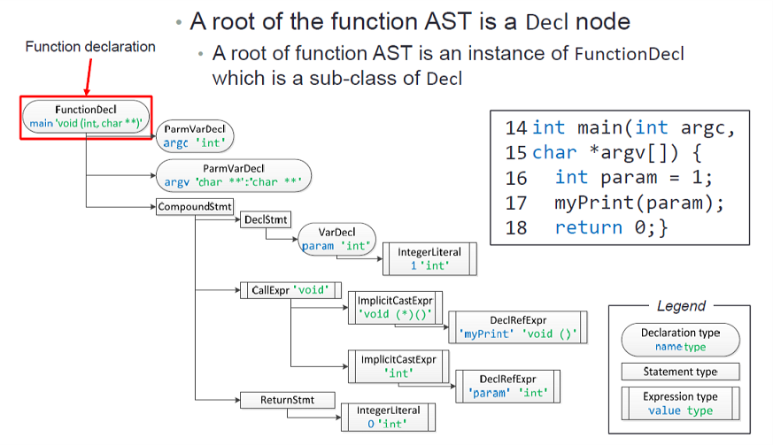

2. 一个 FunctionDecl 可以通过一个 ParmVarDecl 来标识参数，注意 ParmVarDecl 与 FunctionDecl 是同级的，都属于 Decl 子类。
3. 函数体是一个 Stmt 实例，其中函数体使用 CompoundStmt 来标识，同样的它也是 Stmt 的一个子类。

   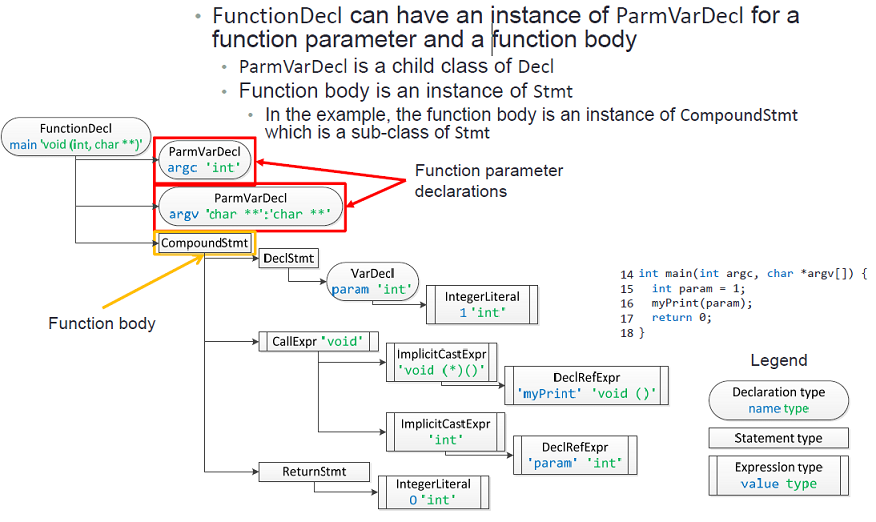

4. VarDecl 用于标识局部和全局变量的声明，注意如果变量声明时有个初始值，那么 VarDecl 就会有一个初始值的子节点。

    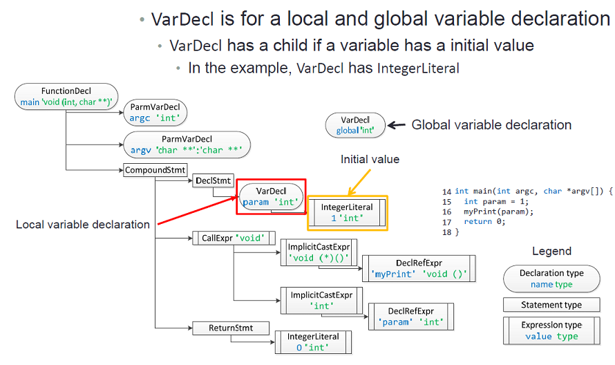

5. FunctionDecl、ParmVarDecl 和 VarDecl 都有一个名称和一个声明类型，在遍历节点查找我们想要的代码块是非常好用的。

   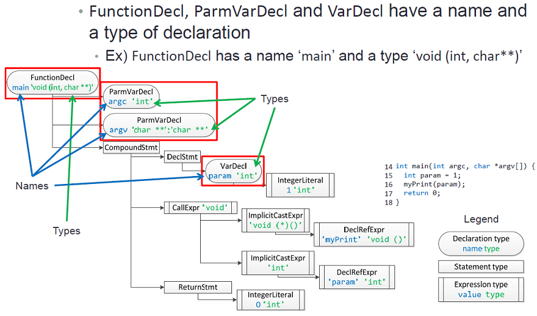

### Stmt

1. Stmt 用于标识代码语句，包含的子类：
   1. CompoundStmt类 用来标识代码块；
   2. DeclStmt类 用来标识局部变量声明；
   3. ReturnStmt类 标识函数返回。

    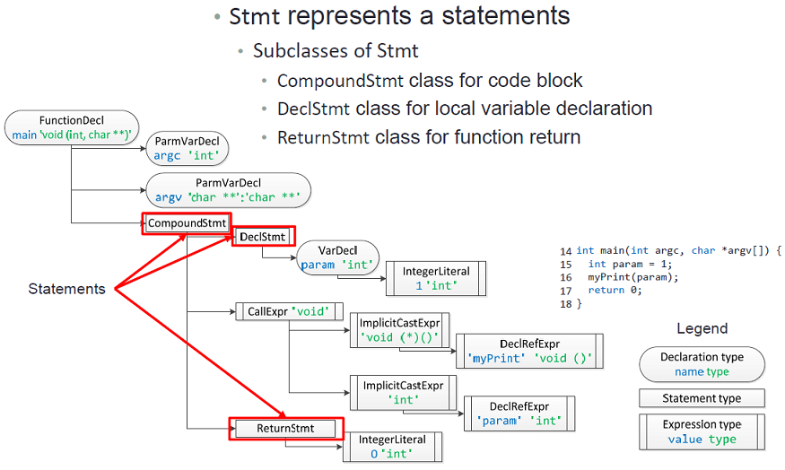

2. Expr 作为 Stmt 的子类，用于标识表达式：
   1. CallExpr 标识函数调用；
   2. ImplicitCastExpr 用于标识隐式强转换的类型；
   3. DeclRefExpr 标识引用声明的变量和函数；
   4. IntegerLiteral 用于整型文字。

    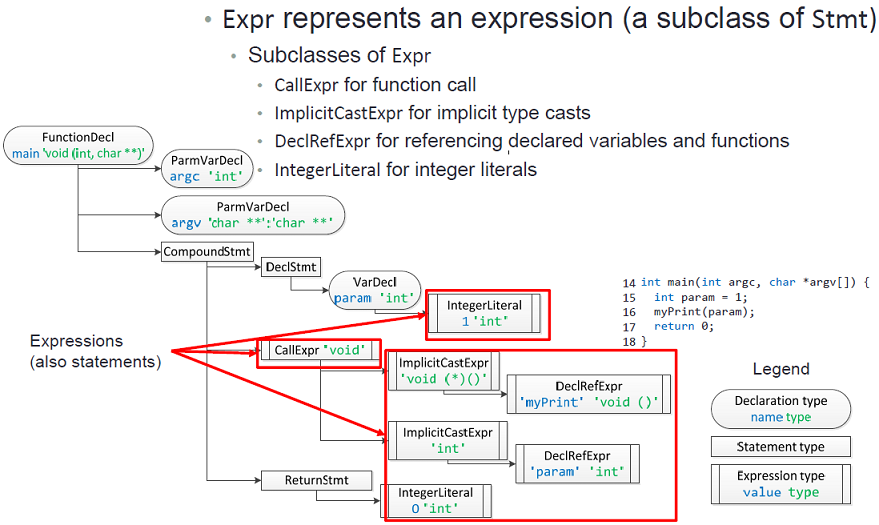

3. Stmt 可能包含一些有着附加信息的子节点，例如 CompoundStmt 标识在一个大括号中代码块的语句，其中的每个语句都是一个包含其他信息的子节点。

    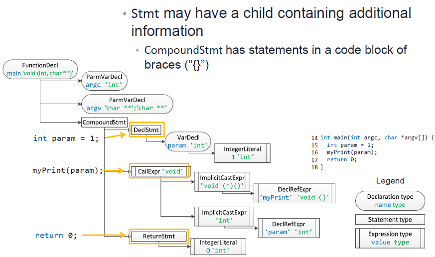

4. 在包含附加信息的子节点中，例如 CallExpr 函数调用类，它的第一个子元素是函数指针，其他的子元素是函数参数，其他节点同理。

    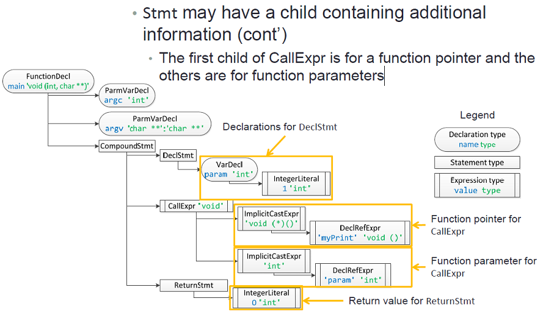

5. Expr类 会有一个表达式的类型，例如 CallExpr 中的节点有个 void 的类型。一些 Expr 的子类会包含一个值，例如 初始化的局部或全局变量 IntegerLiteral 子节点，就有一个 1 'int' 。

    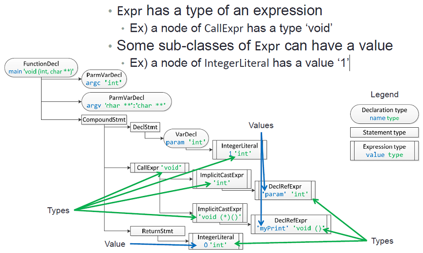

6. 现在让我们关注下更复杂一点的 myPrint 函数，可以看到在其函数体中包含了 IfStmt 和 ForStmt 两种 Stmt 子类。

    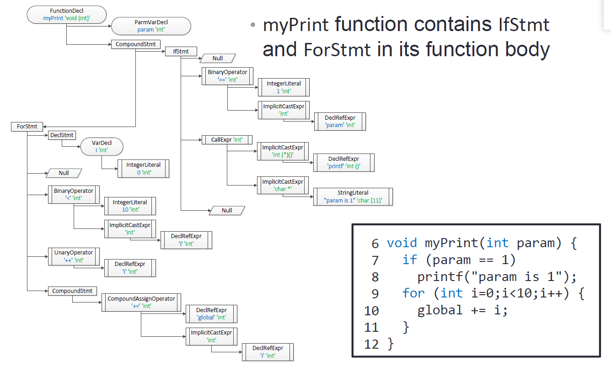

7. IfStmt 有 4 中子节点：
   1. 可以看到一个奇怪的的条件变量（->NULL），这是因为 c++ 中可以在 if 语句的 condition 声明一个变量(而不是在 C 中);
        - 做个实验，这样是不是就很清晰了。

        

   2. 接下来是一个条件判断节点;
   3. 然后是该 if 判断的代码段;
   4. 最后是 Else 的代码段。

    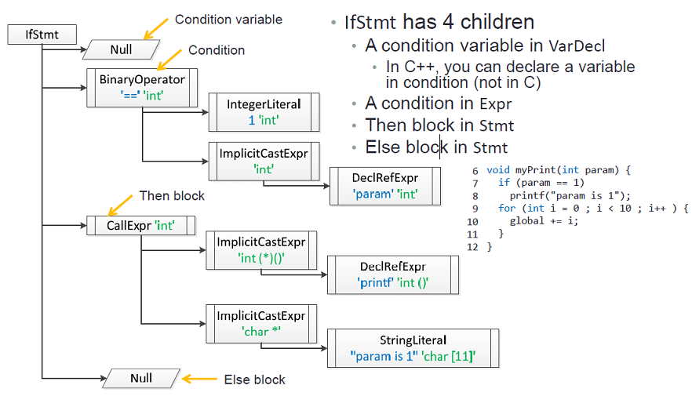

8. ForStmt 有 5 个子节点：
   1. for 循环判断的初始化语句，for(`int i = 0`; i < 10; i++)；
   2. VarDecl类标识的 for 的条件变量定义；
      - 说的有点难懂，做个实验

        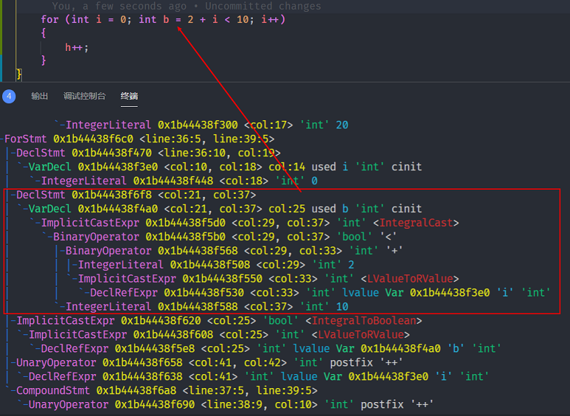

   3. for 判断条件，for(int i = 0; `i < 10`; i++)；
   4. ++段，for(int i = 0; i < 10; `i++`)；
   5. Stmt 标识 for 中的循环代码块。

    

9. BinaryOperator 二元操作符，存在两个子节点;  UnaryOperator 一元操作符，只有一个子节点。

    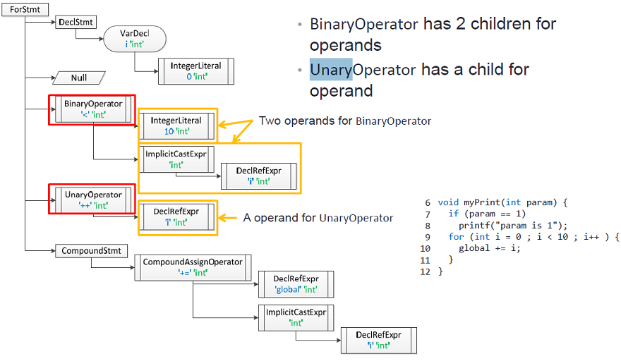

## 遍历 Clang AST

- 通过[官方的一篇教程](http://clang.llvm.org/docs/RAVFrontendAction.html)以及[下图](https://www.cnblogs.com/zhangke007/p/4714245.html) 可以了解到构建、遍历 AST 树需要的几个功能类，分别是 [CompilerInstance](http://clang.llvm.org/doxygen/classclang_1_1CompilerInstance.html#details)、FrontendAction、ParseAST、ASTConsumer、RecursiveASTVisitor。

    

1. CompilerInstance: 用于管理 Clang 编译器单个实例的 Helper 类。它主要有两个用处：
   1. 它管理运行编译器所需的各种对象，例如预处理器，目标信息和 AST 上下文。
   2. 它提供了用于构造和操作通用 Clang 对象的实用程序例程。

2. 从 CompilerInstance 可以了解到两点用处： 第一点对我们构建 AST 用处不大，主要是第二点中是管理和操作 Clang Tool 工具实用的程序历程，这点很有启发。[官方教程](http://clang.llvm.org/docs/RAVFrontendAction.html)是通过 ASTFrontendActions 来实现 AST 树遍历。其中我们可以了解到：
   - 在编写基于 Clang 的工具（例如 Clang 插件）或基于 LibTooling 的独立工具时，常见的入口点是 FrontendAction。其允许在编译过程中执行用户特定的操作。如果想要在 Clang AST 树上运行工具，提供了方便的接口 ASTFrontendAction，该接口负责执行操作。剩下的唯一部分是实现 CreateASTConsumer 方法，该方法为每个翻译单元返回 ASTConsumer。

3. 从 FrontendAction 可以了解到如果想运行基于 libTooling 的工具，直接实现一个 ASTFrontendAction 入口以及 ASTConsumer 即可，这样完全没有 ParseAST 什么事情了呀？？为了搞清楚我们还是一起来了解一下 clang::ParseAST() 它到底干了什么，这个方法提供了构建和遍历 AST 的功能，接口定义如下：

    ```c++
    /// Parse the entire file specified, notifying the ASTConsumer as
    /// the file is parsed.
    ///
    /// This operation inserts the parsed decls into the translation
    /// unit held by Ctx.
    ///
    /// \param PrintStats Whether to print LLVM statistics related to parsing.
    /// \param TUKind The kind of translation unit being parsed.
    /// \param CompletionConsumer If given, an object to consume code completion
    /// results.
    /// \param SkipFunctionBodies Whether to skip parsing of function bodies.
    /// This option can be used, for example, to speed up searches for
    /// declarations/definitions when indexing.
    void ParseAST(Preprocessor &pp, ASTConsumer *C,
                ASTContext &Ctx, bool PrintStats = false,
                TranslationUnitKind TUKind = TU_Complete,
                CodeCompleteConsumer *CompletionConsumer = nullptr,
                bool SkipFunctionBodies = false);
    ```

    - 其中注意 `ASTConsumer *C` ，根据注释描述可知解析完成的源码文件会通过 ASTConsumer 来回传给我们，所以在调用这个接口时我们要实现一个 ASTConsumer 用来获取、遍历 AST 树。查看 ASTConsumer 的定义可以发现许多回调接口，包括不同类型、层级 AST 结构，这下真相大白了，可以发现 ParseAST() 接口可以说是 Clang AST 树解析和构建的核心了，但是它的特性其实主要在于解析以及通过钩子 ASTConsumer 来把分析后的 AST 节点回传给我们，而我们在使用 ASTFrontendAction 时是会重写 CreateASTConsumer 方法，相当于 ASTFrontendAction 会帮我们调用  ParseAST() 接口并将我们的 ASTConsumer 实例注册进去，这样我们在使用过程中完全不用关心它😀，下边举一个编写自己 ASTConsumer 与 ASTFrontendAction 的例子，通过继承 ASTConsumer、ASTFrontendAction 然后重写相关函数接口即可：

    ```c++
    //-------------------------------------------------------------------------
    //ASTConsumer.h
    //-------------------------------------------------------------------------
    /// HandleTopLevelDecl - Handle the specified top-level declaration.  This is
    /// called by the parser to process every top-level Decl*.
    ///
    /// \returns true to continue parsing, or false to abort parsing.
    virtual bool HandleTopLevelDecl(DeclGroupRef D);
    ///////////////////////////////////////////////////////////////////////////
    //-------------------------------------------------------------------------
    //FrontendAction.h
    //-------------------------------------------------------------------------
    /// Provide a default implementation which returns aborts;
    /// this method should never be called by FrontendAction clients.
    std::unique_ptr<ASTConsumer> CreateASTConsumer(CompilerInstance &CI,
                                                    StringRef InFile) override;
    /// Callback at the end of processing a single input.
    ///
    /// This is guaranteed to only be called following a successful call to
    /// BeginSourceFileAction (and BeginSourceFile).
    virtual void EndSourceFileAction() {}
    ///////////////////////////////////////////////////////////////////////////
    //-------------------------------------------------------------------------
    //example.cpp
    //-------------------------------------------------------------------------
    #include <clang/AST/ASTConsumer.h>
    #include <clang/Parse/ParseAST.h>
    #include <clang/AST/DeclGroup.h>
    #include <clang/Frontend/FrontendActions.h>
    #include <clang/Rewrite/Core/Rewriter.h>

    using namespace clang;
    class MyASTConsumer : public ASTConsumer
    {
    public:
        MyASTConsumer() {}
        bool HandleTopLevelDecl(DeclGroupRef DR) override
        {
            //for (DeclGroupRef::iterator b = DR.begin(), e = DR.end(); b != e; ++b)
            for (auto& b : DR)
            {
                // variable b has each decleration in DR
            }
            return true;
        }
    };

    // For each source file provided to the tool, a new FrontendAction is created.
    class MyFrontendAction : public ASTFrontendAction
    {
    public:
        MyFrontendAction() = default;
        void EndSourceFileAction() override
        {
            // EndSourceFileAction
        }

        std::unique_ptr<ASTConsumer> CreateASTConsumer(CompilerInstance& CI, StringRef file) override
        {
            return std::make_unique<MyASTConsumer>();
        }
    };

    ```

4. ASTConsumer 中有很多 HOOK 函数，我这里以 HandleTopLevelDecl 接口为例，它会返回给我们 top-level 的节点，接下来就是遍历这个节点以下所有的信息。这里需要了解一个新的类模板 RecursiveASTVisitor，我们可以通过这个类模板生成一个自己的 visitor 用来遍历某个节点所有的子节点：
  
    ```c++
    //-------------------------------------------------------------------------
    //example.cpp
    //-------------------------------------------------------------------------
    #include <clang/AST/ASTConsumer.h>
    #include <clang/AST/DeclGroup.h>
    #include <clang/AST/RecursiveASTVisitor.h>
    #include <clang/Parse/ParseAST.h>
    #include <clang/Rewrite/Core/Rewriter.h>

    #include "spdlog/spdlog.h"

    using namespace clang;

    class MyASTVisitor : public RecursiveASTVisitor<MyASTVisitor>
    {
        bool VisitStmt(Stmt* s)
        {
            spdlog::info("\t{} \n", s->getStmtClassName());
            return true;
        }

        bool VisitFunctionDecl(FunctionDecl* f)
        {
            if (f->hasBody())
            {
                Stmt* FuncBody = f->getBody();
                spdlog::info("{}\n", f->getName());
            }
            return true;
        }
    };

    class MyASTConsumer : public ASTConsumer
    {
    public:
        MyASTConsumer(Rewriter& R) {}
        bool HandleTopLevelDecl(DeclGroupRef DR) override
        {
            for (auto& b : DR)
            {
                MyASTVisitor Visitor;
                Visitor.TraverseDecl(b);
            }
            return true;
        }
    };
    ```

5. 介绍下 RecursiveASTVisitor 类模板，它会按照深度优先的搜索顺序遍历每个 Stmt 节点，并且对 AST 树中的每个 Stmt 节点调用类模板中 VisitStmt() 方法，如果 VisitStmt 返回 false 的话，则递归遍历将结束。

    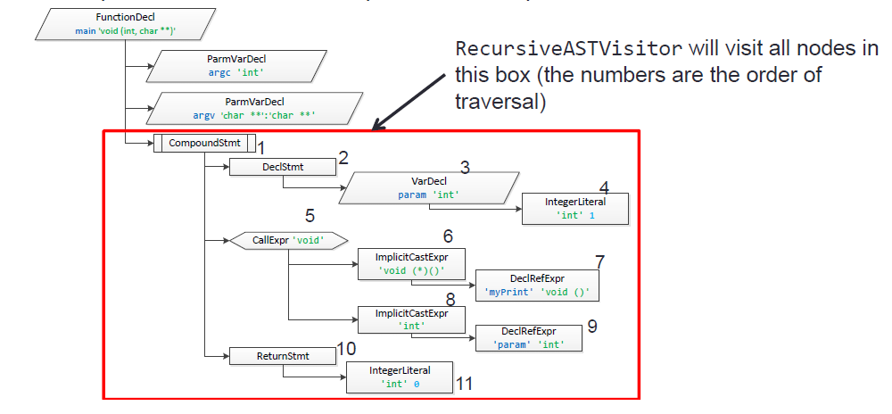

6. 最后还剩下一个疑问点就是，CompilerInstance 该怎么用起来呢？这里就要提到另一个类了 [ClangTool](http://clang.llvm.org/doxygen/classclang_1_1tooling_1_1ClangTool.html)，这个类可以让我们编写的功能模块像 clang-tidy、clang-format 等等，变身成命令行程序。大致来说就是将我们的 MyFrontendAction 传给它，会自动的创建 CompilerInstance 来运行，详细的使用方法在下边的例子里会给出。至此编写工具来解析 AST 树的方法介绍完毕了。

## Example

- 接下来将通过上边的知识，分析下之前已经出场过的一个功能模块，一个遍历打印出AST信息，并且可以判断 if 分支的代码：

    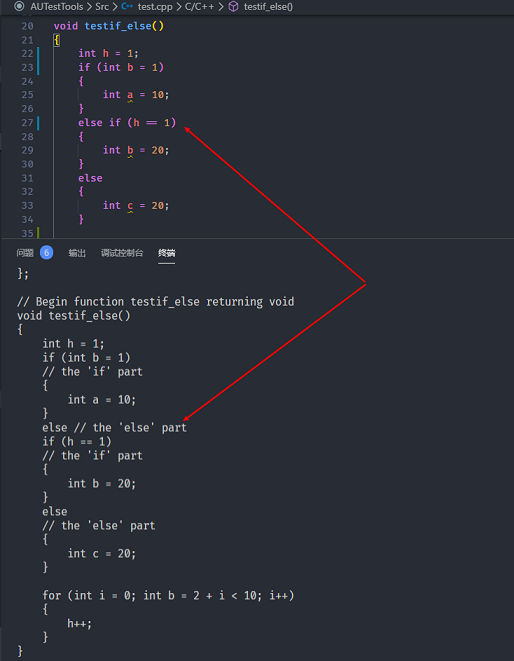

```c++
//-------------------------------------------------------------------------
//example.h
//-------------------------------------------------------------------------
#include <clang/Frontend/FrontendActions.h>
#include <clang/Rewrite/Core/Rewriter.h>

namespace clang
{
// For each source file provided to the tool, a new FrontendAction is created.
class MyFrontendAction : public ASTFrontendAction
{
public:
    MyFrontendAction() = default;
    void EndSourceFileAction() override;

    std::unique_ptr<ASTConsumer> CreateASTConsumer(CompilerInstance& CI, StringRef file) override;

private:
    Rewriter TheRewriter;
};
} // namespace clang

int Function(int argc, const char** argv);
//-------------------------------------------------------------------------
//example.cpp
//-------------------------------------------------------------------------
//------------------------------------------------------------------------------
// Tooling sample. Demonstrates:
//
// * How to write a simple source tool using libTooling.
// * How to use RecursiveASTVisitor to find interesting AST nodes.
// * How to use the Rewriter API to rewrite the source code.
//
// Eli Bendersky (eliben@gmail.com)
// This code is in the public domain
//------------------------------------------------------------------------------
#include <sstream>
#include <string>

#include "clang/AST/AST.h"
#include "clang/AST/ASTConsumer.h"
#include "clang/AST/RecursiveASTVisitor.h"
#include "clang/Frontend/ASTConsumers.h"
#include "clang/Frontend/CompilerInstance.h"
#include "clang/Tooling/CommonOptionsParser.h"
#include "clang/Tooling/Tooling.h"
#include "llvm/ADT/STLExtras.h"
#include "llvm/Support/raw_ostream.h"


#include "Function/LoopConvert.h"

using namespace clang;
using namespace clang::driver;
using namespace clang::tooling;

static llvm::cl::OptionCategory ToolingSampleCategory("Tooling Sample");

// By implementing RecursiveASTVisitor, we can specify which AST nodes
// we're interested in by overriding relevant methods.
class MyASTVisitor : public RecursiveASTVisitor<MyASTVisitor>
{
public:
    MyASTVisitor(Rewriter& R) : TheRewriter(R) {}

    bool VisitStmt(Stmt* s)
    {
        // Only care about If statements.
        if (isa<IfStmt>(s))
        {
            auto* IfStatement = cast<IfStmt>(s);
            Stmt* Then = IfStatement->getThen();

            TheRewriter.InsertText(Then->getBeginLoc(), "// the 'if' part\n", true, true);

            Stmt* Else = IfStatement->getElse();
            if (Else)
                TheRewriter.InsertText(Else->getBeginLoc(), "// the 'else' part\n", true, true);
        }

        return true;
    }

    bool VisitFunctionDecl(FunctionDecl* f)
    {
        // Only function definitions (with bodies), not declarations.
        if (f->hasBody())
        {
            Stmt* FuncBody = f->getBody();

            // Type name as string
            QualType QT = f->getReturnType();
            std::string TypeStr = QT.getAsString();

            // Function name
            DeclarationName DeclName = f->getNameInfo().getName();
            std::string FuncName = DeclName.getAsString();

            // Add comment before
            std::stringstream SSBefore;
            SSBefore << "// Begin function " << FuncName << " returning " << TypeStr << "\n";
            SourceLocation ST = f->getSourceRange().getBegin();
            TheRewriter.InsertText(ST, SSBefore.str(), true, true);

            // And after
            std::stringstream SSAfter;
            SSAfter << "\n// End function " << FuncName;
            ST = FuncBody->getEndLoc().getLocWithOffset(1);
            TheRewriter.InsertText(ST, SSAfter.str(), true, true);
        }

        return true;
    }

private:
    Rewriter& TheRewriter;
};

// Implementation of the ASTConsumer interface for reading an AST produced
// by the Clang parser.
class MyASTConsumer : public ASTConsumer
{
public:
    MyASTConsumer(Rewriter& R) : Visitor(R) {}

    // Override the method that gets called for each parsed top-level
    // declaration.
    bool HandleTopLevelDecl(DeclGroupRef DR) override
    {
        for (auto& b : DR)
        {
            // Traverse the declaration using our AST visitor.
            Visitor.TraverseDecl(b);
            b->dump();
        }
        return true;
    }

private:
    MyASTVisitor Visitor;
};

std::unique_ptr<ASTConsumer> MyFrontendAction::CreateASTConsumer(CompilerInstance& CI, StringRef file)
{
    llvm::errs() << "** Creating AST consumer for: " << file << "\n";
    TheRewriter.setSourceMgr(CI.getSourceManager(), CI.getLangOpts());
    return std::make_unique<MyASTConsumer>(TheRewriter);
}
void MyFrontendAction::EndSourceFileAction()
{
    SourceManager& SM = TheRewriter.getSourceMgr();
    llvm::errs() << "** EndSourceFileAction for: " << SM.getFileEntryForID(SM.getMainFileID())->getName() << "\n";

    // Now emit the rewritten buffer.
    TheRewriter.getEditBuffer(SM.getMainFileID()).write(llvm::outs());
}

int main(int argc, const char** argv)
{
    CommonOptionsParser op(argc, argv, ToolingSampleCategory);
    ClangTool Tool(op.getCompilations(), op.getSourcePathList());

    // ClangTool::run accepts a FrontendActionFactory, which is then used to
    // create new objects implementing the FrontendAction interface. Here we use
    // the helper newFrontendActionFactory to create a default factory that will
    // return a new MyFrontendAction object every time.
    // To further customize this, we could create our own factory class.
    return Tool.run(newFrontendActionFactory<MyFrontendAction>().get());
}
```

1. 使用命令行来初始化 Clang 工具，这里需要使用 CommonOptionsParser 类。查看注释可以了解到，这个类是所有命令行 clang 工具公用的命令解析器，它可以解析命令行命令参数，例如指定 `compilation commands database` 链接路径，或者用户执行时指定的其他指令。

    ```c++
    /// A parser for options common to all command-line Clang tools.
    ///
    /// Parses a common subset of command-line arguments, locates and loads a
    /// compilation commands database and runs a tool with user-specified action. It
    /// also contains a help message for the common command-line options.
    ///
    /// An example of usage:
    /// \code
    /// #include "clang/Frontend/FrontendActions.h"
    /// #include "clang/Tooling/CommonOptionsParser.h"
    /// #include "clang/Tooling/Tooling.h"
    /// #include "llvm/Support/CommandLine.h"
    ///
    /// using namespace clang::tooling;
    /// using namespace llvm;
    ///
    /// static cl::OptionCategory MyToolCategory("My tool options");
    /// static cl::extrahelp CommonHelp(CommonOptionsParser::HelpMessage);
    /// static cl::extrahelp MoreHelp("\nMore help text...\n");
    /// static cl::opt<bool> YourOwnOption(...);
    /// ...
    ///
    /// int main(int argc, const char **argv) {
    ///   CommonOptionsParser OptionsParser(argc, argv, MyToolCategory);
    ///   ClangTool Tool(OptionsParser.getCompilations(),
    ///                  OptionsParser.getSourcePathList());
    ///   return Tool.run(newFrontendActionFactory<SyntaxOnlyAction>().get());
    /// }
    /// \endcode
    class CommonOptionsParser {...}
    ```

2. `ClangTool::run accepts a FrontendActionFactory` 这也就是我们想要运行自己编写的 FrontendAction 入口了，将其传入即可。
3. 当构建 AST 树后会调用 MyFrontendAction::CreateASTConsumer 来使用我们客制化实现的 ASTConsumer，并将相关节点返回给我们。MyFrontendAction 中可以发现有一个 TheRewriter 成员，这是一个重写器，主要是用来将我们 if else 添加完注释的代码进行回写。
4. HandleTopLevelDecl 会回调给我们相应的节点信息，使用 MyASTVisitor 来实现我们想要的功能即可。

## 其他注意

- 通过重写了 [virtual bool  HandleTopLevelDecl (DeclGroupRef D)](https://clang.llvm.org/doxygen/classclang_1_1ASTConsumer.html#ad34fb88d1588902a847926224c8c939b) 来实现了遍历 top-level 的 Decl，这个接口有个特点是每次分析到一个顶层定义时就会回调，也就是说调用这个接口时文件还没有分析完成，相当于一边分析，一边调用，
  - [DeclGroupRef](https://clang.llvm.org/doxygen/classclang_1_1DeclGroupRef.html) 一组定义的列表节点引用。

- 还有一个 [virtual void HandleTranslationUnit (ASTContext &Ctx)](https://clang.llvm.org/doxygen/classclang_1_1ASTConsumer.html#a2bea2db1d0e8af16c60ee7847f0d46ff) 当整个翻译单元的 AST 已被解析时，将调用此方法。
  - [ASTContext](https://clang.llvm.org/doxygen/classclang_1_1ASTContext.html) 包含在整个文件的语义分析中所查找到的长寿 AST 节点，例如类型以及定义。也就是说包含了文件分析后所有 AST 关键节点信息。
