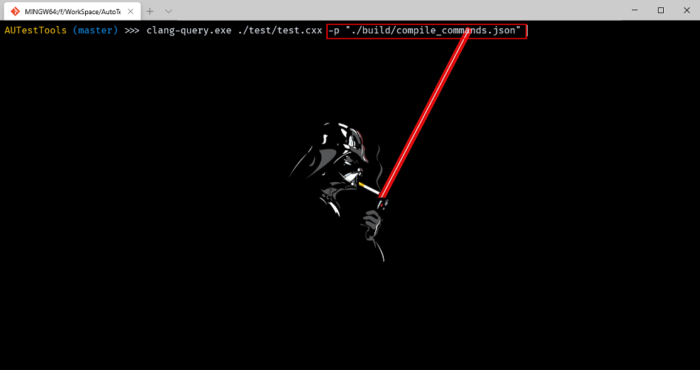
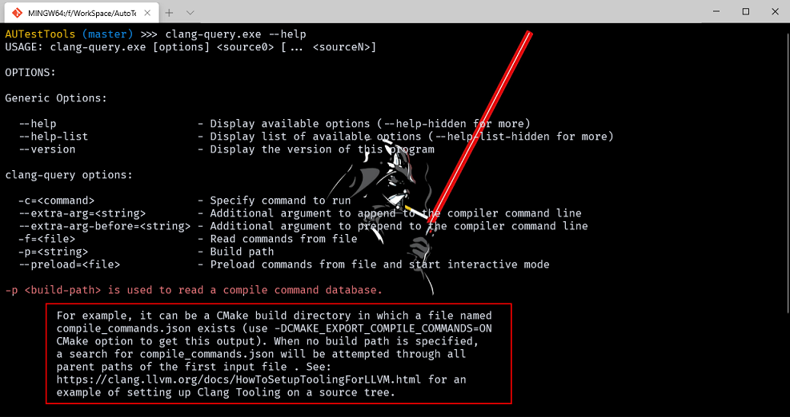
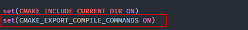
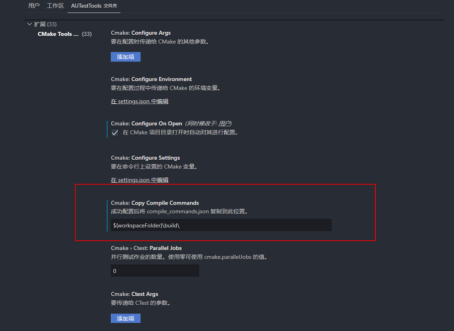
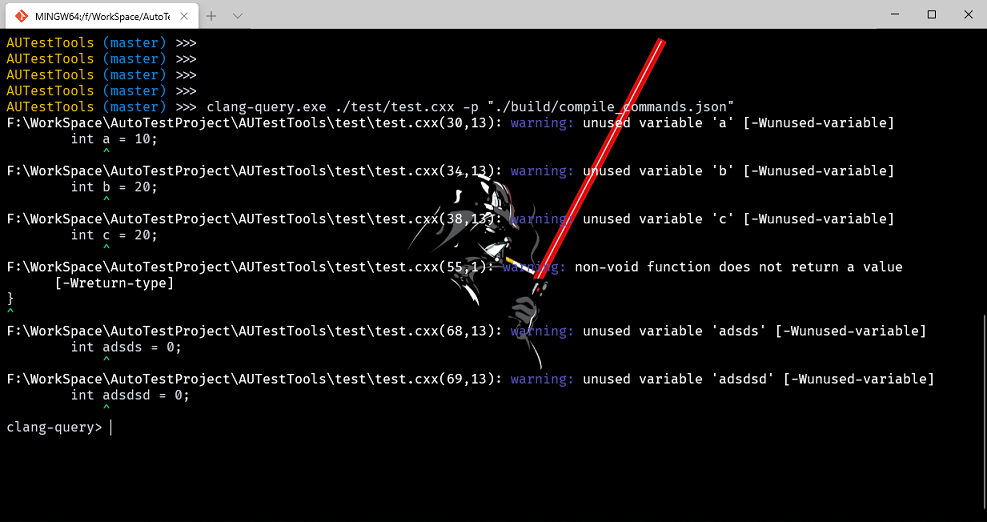
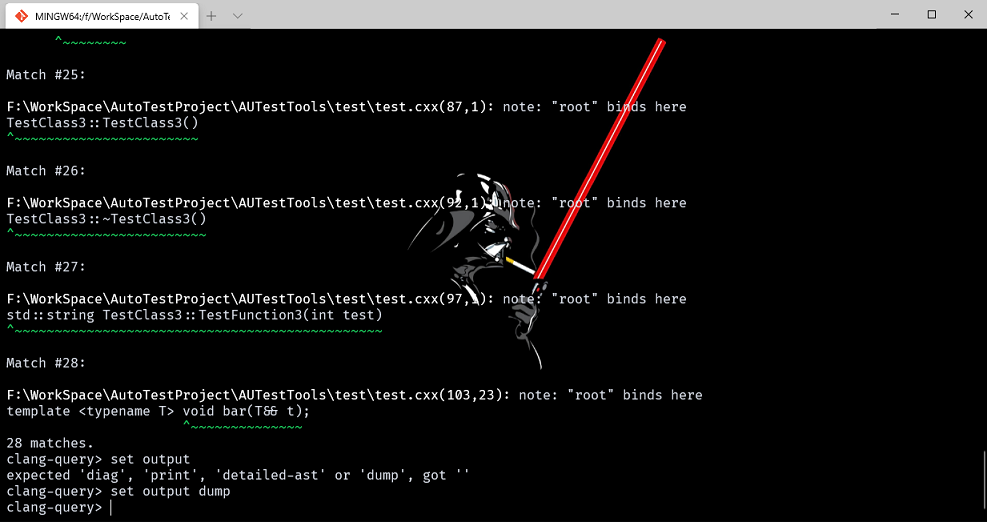

# Clang ASTMatcher 学习

- [Clang ASTMatcher 学习](#clang-astmatcher-学习)
  - [前言](#前言)
  - [ASTMatcher 介绍](#astmatcher-介绍)
    - [使用 clang-query](#使用-clang-query)
  - [在程序中使用 AST Mathcer](#在程序中使用-ast-mathcer)
  - [解析匹配节点](#解析匹配节点)
  - [其他](#其他)
    - [获取错误信息](#获取错误信息)
  - [测试代码 test.cxx](#测试代码-testcxx)

## 前言

在上一章中介绍了一个通过递归遍历整个 AST 树的方法 `RecursiveASTVisitor` ，但当我们开始使用它来实现一些功能时发现可能由于代码结构比较复杂，想要找到我们需要的目标代码节点需要编写大量的代码来实现。本章介绍一个新的功能 clang ASTMatcher ，它提供了给我们一些语法、接口可以通过类似命令行的方式来实现快速匹配我们需要的节点，并且配合 clang-query 来快速验证查询语法的正确性，大大提高效率。

## ASTMatcher 介绍

一些基础的概念，参考了这篇[文章](https://cloud.tencent.com/developer/article/1523137)，主要的内容如下：

- ASTMatcher 主要时允许用户**通过 matcher 提供的规则**编写一个程序来匹配 AST 节点并能通过访问节点的 c++ 接口来获取该 AST 节点的属性、源位置等任何信息，其主要由宏与模板驱动，用法和函数式编程类似，其可实现简单精准高效的匹配。
- [主要的规则](https://clang.llvm.org/docs/LibASTMatchersReference.html)
  - Note Matchers：匹配特定类型节点；
    - eg: objcPropertyDecl() ：匹配 OC 属性声明节点。
  - Narrowing Matchers：匹配具有相应属性的节点；
    - eg: hasName()、hasAttr()：匹配具有指定名称、attribute 的节点。
  - AST Traversal Matchers：允许在节点之间递归匹配；；
    - eg: hasAncestor()、hasDescendant()：匹配祖、后代类节点。

一下子一堆的概念，是不是一脸懵逼，没关系后边我会提供一个可以运行的例子，看再多概念总没有实际操作一把来的有意思，但是这些基础的知识还是要先了解下，我们可以先从官方提供的文档入手，[ASTMatcher 官方文档](https://clang.llvm.org/docs/LibASTMatchers.html)。

看不太懂没有关系，也可以直接来看下这个例子：

```c++
recordDecl(hasName("Foo"), isDerivedFrom("Bar"))
```

- 在这段代码中，`recordDecl` 、`hasName` 、`isDerivedFrom`，都属于 clang matcher 提供给我们的功能函数，具体的功能可以在这个[规则](https://clang.llvm.org/docs/LibASTMatchersReference.html)网站中查找到。
  - 以 recordDecl 为例，搜索下可以得到下图的结果，查看描述可以发现他是用来匹配**类、结构体、联合体声明**的节点。因此 recordDecl() 的含义就是匹配所有类、结构体、联合体声明的节点。
  
    

  - 但是有可能在一个 AST 树中有超级多的声明，因此我们需要缩小查询范围，查询 hasName 可以知道它是用来匹配具有指定名称的节点。因此 `recordDecl(hasName("Foo"))` 的含义就是匹配所有类、结构体、联合体声明的节点**中名称为 Foo 的节点**。
  - `isDerivedFrom(xxx)` 是匹配从 xxx 派生的类，`recordDecl(hasName("Foo"), isDerivedFrom("Bar"))` 这么编写就是进一步缩小定位的方位，匹配所有类、结构体、联合体声明的节点中名称为 Foo 的节点**且必须是从 Bar 派生出来的节点**。

```c++
recordDecl(anyOf(hasName("Foo"), isDerivedFrom("Bar")))
```

- 让我们修改下演示的代码，可以发现 anyOf 这个关键字，它表示 `hasName("Foo")` 与 `isDerivedFrom("Bar")` 这两个条件有一个成立即可匹配（类似 |）。
  - 类似的还有 `allOf(A, B)` 标识 A 与 B 要同时成立才可以（类似 & ），`unless(A)` 匹配 A 不成立的节点（类似 ! ）。
  - anyOf is like "or", allOf can implement "and", and unless is like "not".

### 使用 clang-query

当我们编写了匹配器想要测试怎么办，难道改一点就要重新编译链接运行，好在 clang 提供了好用的 clang-query 工具可以方便我们验证编写的匹配器语法是否正确。**首先准备一些测试代码，源码见文末**。

使用 clang-query 如下：



- 这个命令的前半段没有什么好讲解的，目标文件就是 ./test/test.cxx。
  - 我们需要重点关注下 -p "./build/compile_commands.json"。
    - -p 的解释如下图，指定 compile_commands.json 这个文件的路径所在。

        

    - compile_commands.json 文件包含了编译过程中的宏定义、头文件路径、编译器等信息，而 clang 在解析生成 AST 树时需要预编译，所以需要这些信息防止头文件找不到等等问题。compile_commands.json 我们可以通过 cmake 来生成，[参考这篇文章](https://segmentfault.com/a/1190000007015981)。
  
        

    - 我们在之前的文章中一直使用 CmakeTools 工具，它的配置比较简单如下图设置即可。

        

- 接下来执行 clang-query 命令，可以看到一些源码相关的警告后我们进入到 clang-query 的命令行内：

    

  - 执行 `m functionDecl(isExpansionInMainFile())` 运行我们的匹配语句，可以看到它打印出了我们 test.cxx 文件中所有的函数声明，与我们预期时相符的。默认打印的简略信息，如果想要看详细的 AST 结构信息，可以设置 output 方式：

    

- 这样我们就可以不停的尝试当前的 matcher 语句是否正确。

## 在程序中使用 AST Mathcer

使用 matcher 我这举两个简单的方法：

1. 可以将直接将匹配器通过使用 newFrontendActionFactory 实现一个 FrontendAction 并传递给 ClangTool 直接去运行，举例如下：

    ```c++
    int FunctionToAnalyzeCodeTree(int argc, const char** argv)
    {
        auto FuncDeclMatcher =
            functionDecl(isExpansionInMainFile(),
                        anyOf(hasAncestor(cxxRecordDecl().bind("methodclass")), unless(hasAncestor(cxxRecordDecl()))),
                        anyOf(forEachDescendant(callExpr().bind("callExprFunction")),
                            unless(forEachDescendant(callExpr().bind("callExprFunction")))))
                .bind("FunctiondFeclWithCall"); //bind 不了解没有关系 后边会讲到
        CommonOptionsParser OptionsParser(argc, argv, ToolingSampleCategory);
        ClangTool Tool(OptionsParser.getCompilations(), OptionsParser.getSourcePathList());
        Func_Call FuncCall;
        MatchFinder Finder;
        Finder.addMatcher(FuncDeclMatcher, &FuncCall);
        return Tool.run(newFrontendActionFactory(&Finder).get());
    }
    ```

2. 我们也可以通过前面文章中使用的方法，自己实现一个 FrontendAction 在 CreateAstConsumer 时构建我们需要的匹配器，举例如下:

    ```c++
    class MyFrontendAction : public ASTFrontendAction
    {
    public:
        MyFrontendAction() = default;
        void EndSourceFileAction() override
        {
            auto m = getCompilerInstance().getDiagnostics().getNumWarnings();
            spdlog::info("{} Warning\n", m);
        }
        std::unique_ptr<ASTConsumer> CreateASTConsumer(CompilerInstance& CI, StringRef file) override
        {
            llvm::errs() << "** Creating AST consumer for: " << file << "\n";
            auto m = CI.getDiagnostics().getNumWarnings();
            spdlog::info("{}", m);
            auto FuncDeclMatcher =
                functionDecl(isExpansionInMainFile(),
                            anyOf(hasAncestor(cxxRecordDecl().bind("methodclass")), unless(hasAncestor(cxxRecordDecl()))),
                            anyOf(forEachDescendant(callExpr().bind("callExprFunction")),
                                unless(forEachDescendant(callExpr().bind("callExprFunction")))))
                    .bind("FunctiondFeclWithCall");
            Finder.addMatcher(FuncDeclMatcher, &FuncCall);
            return Finder.newASTConsumer();
        }

    private:
        Func_Call FuncCall;
        MatchFinder Finder;
    };

    int FunctionToAnalyzeCodeError(int argc, const char** argv)
    {
        CommonOptionsParser op(argc, argv, ToolingSampleCategory);
        ClangTool Tool(op.getCompilations(), op.getSourcePathList());

        // ClangTool::run accepts a FrontendActionFactory, which is then used to
        // create new objects implementing the FrontendAction interface. Here we use
        // the helper newFrontendActionFactory to create a default factory that will
        // return a new MyFrontendAction object every time.
        // To further customize this, we could create our own factory class.
        return Tool.run(newFrontendActionFactory<MyFrontendAction>().get());
    }
    ```

3. 你可能发现了一个特殊的类 Func_Call 这个是我自己定义的，他继承 MatchFinder::MatchCallback ，当使用 MatchFinder 的 addMatcher 方法中与匹配器一起注册进去后，每当我们的匹配器匹配到相应的节点就会调用 run 方法，我们只需要重写它的 run 方法实现需要的功能即可。

    ```c++
    class Func_Call : public MatchFinder::MatchCallback
    {
    public:
        void run(const MatchFinder::MatchResult& Result) override
        {
        }
    };
    ```

## 解析匹配节点

1. 当有节点匹配到后会调用 MatchCallback 的 run 方法，它会传入一个 MatchResult 的参数，我们可以通过参数中包含的信息来实现一些基础的功能，本小节就通过一个查找当前源文件中所有的函数声明的例子来讲解。
    - 首先分析下匹配器：
      - functionDecl() 查找所有的函数与方法的声明节点，我们可以发现它有一个 bind() 方法，作用是可以将所有匹配到的节点绑定到 bind 方法传入的字符串标识上，当我们需要使用时就可以通过这个标识拿到匹配的节点。
      - isExpansionInMainFile() 表示是当前目标文件中的定义，不会匹配到你 include 的头文件中去。
      - anyOf() 里可以发现前边是查找类中的方法定义，后边是 unless 又将范围给取消了，主要是想将查找到的类方法类名给 bind 起来方便使用，而对于匹配器的匹配范围没有什么影响。
      - 第二个 anyOf() 也是同理，查找所有函数声明体中调用的函数节点，这么些貌似有些挫，暂时还没有找到更好的匹配器写法，有知道的同学麻烦告知下，谢谢。
      - 其实总的来说这个匹配器就是匹配目标源文件中所有的函数声明，包括全局的函数声明，以及类方法的声明。其他的匹配项仅仅是为了将相关联的节点绑定起来方便使用。

    ```c++
    functionDecl(isExpansionInMainFile(),
                anyOf(hasAncestor(cxxRecordDecl().bind("methodclass")), unless(hasAncestor(cxxRecordDecl()))),
                anyOf(forEachDescendant(callExpr().bind("callExprFunction")),
                    unless(forEachDescendant(callExpr().bind("callExprFunction")))))
        .bind("FunctiondFeclWithCall");
    ```

2. 知道了匹配器的功能接下来然我们实现一个打印出函数声明相关信息的功能：

    ```c++
    class Func_Call : public MatchFinder::MatchCallback
    {
    public:
        void run(const MatchFinder::MatchResult& Result) override
        {
            std::string classname;
            std::string functionname;
            std::string functionparms;
            std::string callexprname;
            std::string callexprparms;

            clang::LangOptions LangOpts;
            LangOpts.CPlusPlus = true;
            clang::PrintingPolicy Policy(LangOpts); //指定标志为c++ 模式，用于从expr 获取类型字符串
            //从 Result 参数中获得当前的函数声明节点，这里就使用到了匹配器 bind 的标识
            if (auto const* functionDecl = Result.Nodes.getNodeAs<FunctionDecl>("FunctiondFeclWithCall"))
            {
                if (!functionDecl->hasBody()) //判断函数是否有函数体，仅有一个声明的没有实现的函数停止解析
                {
                    return;
                }
                //以下就是获取函数的名称、参数、返回值相关信息，接口描述都很清晰，主要注意函数参数获取方式用到的 QualType 使用方法
                functionname = functionDecl->getNameAsString();
                functionname += " | ";
                functionname += functionDecl->getQualifiedNameAsString();
                functionparms = "Return: ";
                functionparms += functionDecl->getReturnType().getAsString();
                if (functionDecl->getNumParams() > 0)
                {
                    functionparms += " | Param: ";
                    for (unsigned int i = 0; i < functionDecl->getNumParams(); i++)
                    {
                        auto param = functionDecl->getParamDecl(i);
                        functionparms += QualType::getAsString(param->getType().split(), Policy);
                        functionparms += "  ";
                        functionparms += functionDecl->getParamDecl(i)->getNameAsString();
                        functionparms += " | ";
                    }
                }
                else
                {
                    functionparms += " | Param: NULL";
                }
            }
            // 获取当前方法函数声明所在的类，如果是一个全局函数非类方法则这个节点是没有的
            if (auto const* classdecl = Result.Nodes.getNodeAs<CXXRecordDecl>("methodclass"))
            {
                classname = classdecl->getNameAsString();
            }
            // 获取函数体中所调用的其他函数信息
            if (auto const* callexprtdec = Result.Nodes.getNodeAs<CallExpr>("callExprFunction"))
            {
                auto func = callexprtdec->getDirectCallee();
                callexprname = func->getNameInfo().getAsString();
                if (!callexprname.empty())
                {
                    callexprname += " | ";
                    callexprname += func->getQualifiedNameAsString();
                    callexprparms = "Return: ";
                    callexprparms += func->getReturnType().getAsString();
                    if (func->getNumParams() > 0)
                    {
                        callexprparms += " | Param: ";
                        for (unsigned int i = 0; i < func->getNumParams(); i++)
                        {
                            auto param = func->getParamDecl(i);
                            callexprparms += QualType::getAsString(param->getType().split(), Policy);
                            callexprparms += "  ";
                            callexprparms += func->getParamDecl(i)->getNameAsString();
                            callexprparms += " | ";
                        }
                    }
                    else
                    {
                        callexprparms += " | Param: NULL";
                    }
                }
            }
            else
            {
                callexprparms = "NULL";
                callexprname = "CALL NULL";
            }

            spdlog::info("analysis result classname[{}] function[{} type:{}]  callexpr[{} type:{}]\n", classname.c_str(),
                        functionname.c_str(), functionparms.c_str(), callexprname.c_str(), callexprparms.c_str());
        }
    };
    ```

- 以上，我们就将 clang ASTMathcer 基础概念、使用方法说完了。

## 其他

### 获取错误信息

1. 想要获取到源码中的错误、警告信息，需要我们实现一个 DiagnosticConsumer 方法，并在 ASTFrontendAction 的 CreateAstConsumer 调用时，注册掉 CompilerInstance 的 Diagnostic 引擎中去作为 client ，这样当有警告、错误发生时就会回调到我们重写的 HandleDiagnostic 方法中去，下边是一个例子。
   - CompilerInstance 作为类似编译器的一个实体提供各种功能，而 Diagnostic 提供了跟踪处理源代码时可能出现的错误并进行报告的功能。具体的 CompilerInstance 与 Diagnostic 的概念感觉又是一个坑，现在还没有梳理想要了解的需要自己查下相关资料。

```c++
class BlankDiagConsumer : public clang::DiagnosticConsumer
{
public:
    BlankDiagConsumer() = default;
    ~BlankDiagConsumer() override = default;
    void HandleDiagnostic(DiagnosticsEngine::Level DiagLevel, const Diagnostic& Info) override
    {
        SmallString<100> OutStr;
        Info.FormatDiagnostic(OutStr);

        llvm::raw_svector_ostream DiagMessageStream(OutStr);
        auto aa = FullSourceLoc(Info.getLocation(), Info.getSourceManager()).getFileLoc();
        int Line = aa.getLineNumber();
        spdlog::info("{} DiagLevel = {} Message = {} at Line = {}", __FUNCTION__, DiagLevel,
                     DiagMessageStream.str().str().c_str(), Line);
    }
};

class MyFrontendAction : public ASTFrontendAction
{
public:
    MyFrontendAction() = default;
    void EndSourceFileAction() override
    {
        auto& DE = getCompilerInstance().getDiagnostics();
        spdlog::info("{} Warning\n", DE.getNumWarnings());
    }
    std::unique_ptr<ASTConsumer> CreateASTConsumer(CompilerInstance& CI, StringRef file) override
    {
        llvm::errs() << "** Creating AST consumer for: " << file << "\n";
        auto FuncDeclMatcher =
            functionDecl(isExpansionInMainFile(),
                         anyOf(hasAncestor(cxxRecordDecl().bind("methodclass")), unless(hasAncestor(cxxRecordDecl()))),
                         anyOf(forEachDescendant(callExpr().bind("callExprFunction")),
                               unless(forEachDescendant(callExpr().bind("callExprFunction")))))
                .bind("FunctiondFeclWithCall");
        Finder.addMatcher(FuncDeclMatcher, &FuncCall);
        CI.getDiagnostics().setClient(&ctr);
        return Finder.newASTConsumer();
    }

private:
    Func_Call FuncCall;
    MatchFinder Finder;
    BlankDiagConsumer ctr;
};
```

## 测试代码 test.cxx

```c++
//////////////////////////////////
//test.h
//////////////////////////////////
#ifndef __TEST__H__
#define __TEST__H__
#include <string>
class TestClass2
{
public:
    TestClass2();
    ~TestClass2();

    std::string TestFunction(int test);
};

class TestClass3
{
public:
    TestClass3();
    ~TestClass3();

    std::string TestFunction3(int test);
};
#endif
//////////////////////////////////
//test.cxx
//////////////////////////////////
#include "spdlog/spdlog.h"
#include "test.h"
#include <iostream>

extern int testfunction(int a);
enum class Cpp11Enum
{
    RED = 10,
    BLUE = 20
};

struct Wowza
{
    virtual ~Wowza() = default;
    virtual void foo(int i = 0) = 0;
};

struct Badabang : Wowza
{
    void foo(int) override;

    bool operator==(const Badabang& o) const;
};

void testif_else(int ww)
{
    int h = 1;
    if (int b = 1)
    {
        int a = 10;
    }
    else if (h == 1)
    {
        int b = 20;
    }
    else
    {
        int c = 20;
    }

    for (int i = 0; int b = 2 + i < 10; i++)
    {
        h++;
    }
}

std::string notcallall(TestClass3 b)
{
    TestClass3 tmp = b;
    for (int i = 0; int b = 2 + i < 10; i++)
    {
        int h = 0;
        h++;
    }
}

class testclassparent
{
public:
    testclassparent()
    {
        spdlog::info("{} call\n", __FUNCTION__);
        parentFunction(1, 'a');
    }

    ~testclassparent()
    {
        int adsds = 0;
        int adsdsd = 0;
    }

    void parentFunction(int test1, char test2) { spdlog::info("{} call {} -- {}\n", __FUNCTION__, test1, test2); }
};
class testclass : public testclassparent
{
    testclass()
    {
        spdlog::info("{} call\n", __FUNCTION__);
        testfunction(3);
        parentFunction(3, 'c');
        TestClass2 a;
        a.TestFunction(4);
    }
};


TestClass3::TestClass3()
{
    int adsds = 0;
    spdlog::info("{} {}call\n", __FUNCTION__, adsds);
}
TestClass3::~TestClass3()
{
    int adsds = 0;
    spdlog::info("{} {}call\n", __FUNCTION__, adsds);
}
std::string TestClass3::TestFunction3(int test)
{
    int sss;
    spdlog::info("{} {}{}call\n", __FUNCTION__, test, sss);
    return "a";
}
template <typename T> void bar(T&& t);

```
