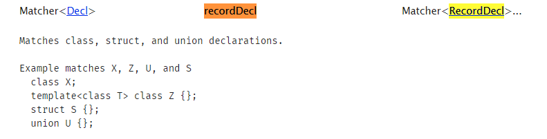

# Clang ASTMatcher 学习

在上一章中介绍了一个通过递归遍历整个 AST 树的方法 `RecursiveASTVisitor` ，但当我们开始使用它来实现一些功能时发现可能由于代码结构比较复杂，想要找到我们需要的目标代码节点需要编写大量的代码来实现，因此本章介绍的 clang ASTMatcher 则提供了给我们一些语法，以及接口可以通过类似命令行的方式来实现快速匹配我们需要的节点，并且配合 clang-query 来快速验证查询语法的正确性，提高效率。

## ASTMatcher 介绍

一些基础的概念，参考了这篇[文章](https://cloud.tencent.com/developer/article/1523137)，主要的内容如下：

- ASTMatcher 主要时允许用户**通过 matcher 提供的规则**编写一个程序来匹配 AST 节点并能通过访问节点的 c++ 接口来获取该 AST 节点的属性、源位置等任何信息，其主要由宏与模板驱动，用法和函数式编程类似，其可实现简单精准高效的匹配。
- [主要的规则](https://clang.llvm.org/docs/LibASTMatchersReference.html)
  - Note Matchers：匹配特定类型节点；
    - eg: objcPropertyDecl() ：匹配 OC 属性声明节点。
  - Narrowing Matchers：匹配具有相应属性的节点；
    - eg: hasName()、hasAttr()：匹配具有指定名称、attribute 的节点。
  - AST Traversal Matchers：允许在节点之间递归匹配；；
    - eg: hasAncestor()、hasDescendant()：匹配祖、后代类节点。

一下子一堆的概念，是不是一脸懵逼，没关系后边我会提供一个可以运行的例子，看再多概念总没有实际操作一把来的有意思，但是这些基础的知识还是要先了解下，我们可以先从官方提供的文档入手，[ASTMatcher 官方文档](https://clang.llvm.org/docs/LibASTMatchers.html)。

看不太懂没有关系，也可以直接来看下这个例子：

```c++
recordDecl(hasName("Foo"), isDerivedFrom("Bar"))
```

- 在这段代码中，`recordDecl` 、`hasName` 、`isDerivedFrom`，都属于 clang matcher 提供给我们的功能函数，具体的功能可以在这个[规则](https://clang.llvm.org/docs/LibASTMatchersReference.html)网站中查找到。
  - 以 recordDecl 为例，搜索下可以得到下图的结果，查看描述可以发现他是用来匹配**类、结构体、联合体声明**的节点。因此 recordDecl() 的含义就是匹配所有类、结构体、联合体声明的节点。
  
    

  - 但是有可能在一个 AST 树中有超级多的声明，因此我们需要缩小查询范围，查询 hasName 可以知道它是用来匹配具有指定名称的节点。因此 `recordDecl(hasName("Foo"))` 的含义就是匹配所有类、结构体、联合体声明的节点**中名称为 Foo 的节点**。
  - `isDerivedFrom(xxx)` 是匹配从 xxx 派生的类，`recordDecl(hasName("Foo"), isDerivedFrom("Bar"))` 这么编写就是进一步缩小定位的方位，匹配所有类、结构体、联合体声明的节点中名称为 Foo 的节点**且必须是从 Bar 派生出来的节点**。

```c++
recordDecl(anyOf(hasName("Foo"), isDerivedFrom("Bar")))
```

- 让我们修改下演示的代码，可以发现 anyOf 这个关键字，他表示 `hasName("Foo")` 与 `isDerivedFrom("Bar")` 这两个条件有一个成立即可匹配（类似 |）。
  - 类似的还有 `allOf(A, B)` 标识 A 与 B 要同时成立才可以（类似 & ），`unless(A)` 匹配 A 不成立的节点（类似 ! ）。
  - anyOf is like "or", allOf can implement "and", and unless is like "not".

使用match 有两个方法：

1. 直接将器包装 newFrontendActionFactory 运行。

    ```c++
    int FunctionToAnalyseCodeTree(int argc, const char** argv)
    {
        auto FuncDeclMatcher =
            functionDecl(isExpansionInMainFile(),
                        anyOf(hasAncestor(cxxRecordDecl().bind("methodclass")), unless(hasAncestor(cxxRecordDecl()))),
                        anyOf(forEachDescendant(callExpr().bind("callExprFunction")),
                            unless(forEachDescendant(callExpr().bind("callExprFunction")))))
                .bind("FunctiondFeclWithCall");
        CommonOptionsParser OptionsParser(argc, argv, ToolingSampleCategory);
        ClangTool Tool(OptionsParser.getCompilations(), OptionsParser.getSourcePathList());
        Func_Call FuncCall;
        MatchFinder Finder;
        Finder.addMatcher(FuncDeclMatcher, &FuncCall);
        return Tool.run(newFrontendActionFactory(&Finder).get());
    }
    ```

2. 使用fontaction:

    ```c++
    class MyFrontendAction : public ASTFrontendAction
    {
    public:
        MyFrontendAction() = default;
        void EndSourceFileAction() override
        {
            auto m = getCompilerInstance().getDiagnostics().getNumWarnings();
            spdlog::info("{} Warning\n", m);
        }
        std::unique_ptr<ASTConsumer> CreateASTConsumer(CompilerInstance& CI, StringRef file) override
        {
            llvm::errs() << "** Creating AST consumer for: " << file << "\n";
            auto m = CI.getDiagnostics().getNumWarnings();
            spdlog::info("{}", m);
            auto FuncDeclMatcher =
                functionDecl(isExpansionInMainFile(),
                            anyOf(hasAncestor(cxxRecordDecl().bind("methodclass")), unless(hasAncestor(cxxRecordDecl()))),
                            anyOf(forEachDescendant(callExpr().bind("callExprFunction")),
                                unless(forEachDescendant(callExpr().bind("callExprFunction")))))
                    .bind("FunctiondFeclWithCall");
            Finder.addMatcher(FuncDeclMatcher, &FuncCall);
            return Finder.newASTConsumer();
        }

    private:
        Func_Call FuncCall;
        MatchFinder Finder;
    };

    int FunctionToAnalyseCodeError(int argc, const char** argv)
    {
        CommonOptionsParser op(argc, argv, ToolingSampleCategory);
        ClangTool Tool(op.getCompilations(), op.getSourcePathList());

        // ClangTool::run accepts a FrontendActionFactory, which is then used to
        // create new objects implementing the FrontendAction interface. Here we use
        // the helper newFrontendActionFactory to create a default factory that will
        // return a new MyFrontendAction object every time.
        // To further customize this, we could create our own factory class.
        return Tool.run(newFrontendActionFactory<MyFrontendAction>().get());
    }
    ```

## 解析

```c++
class Func_Call : public MatchFinder::MatchCallback
{
public:
    void run(const MatchFinder::MatchResult& Result) override
    {
        std::string classname;
        std::string functionname;
        std::string functionparms;
        std::string callexprname;
        std::string callexprparms;

        clang::LangOptions LangOpts;
        LangOpts.CPlusPlus = true;
        clang::PrintingPolicy Policy(LangOpts);
        if (auto const* functionDecl = Result.Nodes.getNodeAs<FunctionDecl>("FunctiondFeclWithCall"))
        {
            if (!functionDecl->hasBody())
            {
                return;
            }
            functionname = functionDecl->getNameAsString();
            functionname += " | ";
            functionname += functionDecl->getQualifiedNameAsString();
            functionparms = "Return: ";
            functionparms += functionDecl->getReturnType().getAsString();
            if (functionDecl->getNumParams() > 0)
            {
                functionparms += " | Param: ";
                for (unsigned int i = 0; i < functionDecl->getNumParams(); i++)
                {
                    auto param = functionDecl->getParamDecl(i);
                    functionparms += QualType::getAsString(param->getType().split(), Policy);
                    functionparms += "  ";
                    functionparms += functionDecl->getParamDecl(i)->getNameAsString();
                    functionparms += " | ";
                }
            }
            else
            {
                functionparms += " | Param: NULL";
            }
        }
        if (auto const* classdecl = Result.Nodes.getNodeAs<CXXRecordDecl>("methodclass"))
        {
            classname = classdecl->getNameAsString();
        }

        if (auto const* callexprtdec = Result.Nodes.getNodeAs<CallExpr>("callExprFunction"))
        {
            auto func = callexprtdec->getDirectCallee();
            callexprname = func->getNameInfo().getAsString();
            if (!callexprname.empty())
            {
                callexprname += " | ";
                callexprname += func->getQualifiedNameAsString();
                callexprparms = "Return: ";
                callexprparms += func->getReturnType().getAsString();
                if (func->getNumParams() > 0)
                {
                    callexprparms += " | Param: ";
                    for (unsigned int i = 0; i < func->getNumParams(); i++)
                    {
                        auto param = func->getParamDecl(i);
                        callexprparms += QualType::getAsString(param->getType().split(), Policy);
                        callexprparms += "  ";
                        callexprparms += func->getParamDecl(i)->getNameAsString();
                        callexprparms += " | ";
                    }
                }
                else
                {
                    callexprparms += " | Param: NULL";
                }
            }
        }
        else
        {
            callexprparms = "NULL";
            callexprname = "CALL NULL";
        }

        spdlog::info("analysis result classname[{}] function[{} type:{}]  callexpr[{} type:{}]\n", classname.c_str(),
                     functionname.c_str(), functionparms.c_str(), callexprname.c_str(), callexprparms.c_str());
    }

    // void onEndOfTranslationUnit() {}
};
```

## 获取错误信息

```c++
auto m = getCompilerInstance().getDiagnostics().getNumWarnings();
spdlog::info("{} Warning\n", m);
```
